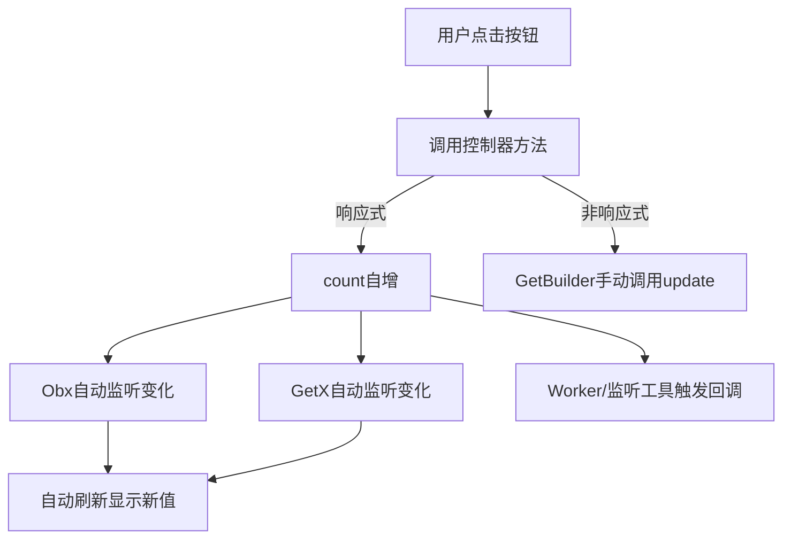

# 🪶序言
## 🧩什么是状态管理？
要说明什么是状态管理，我们就要先理解什么是 **状态** ！<br>
### 1.状态
在软件开发中，**状态** 指的是应用程序或组件在某一时刻的数据和表现形式。<br>
```dart
// 界面显示的数据
int count = 0;               // 计数器当前数值
List<String> items = [];     // 列表数据
String username = "Tom";     // 用户名

// 组件的可见性或选中状态
bool isSwitchOn = false;    // 开关状态
bool isTagSelected = true;  // 标签是否被选中

// 应用的业务逻辑状态
bool isLogged = false;      // 用户登录状态
bool isLoading = false;     // 页面加载状态
String? apiResult;          // 网络请求结果

```
状态的分类:
- **界面显示的数据**：例如计数器的数字、列表数据、用户信息
- **组件的可见性或选中状态**：例如开关按钮是否开启、选中标签
- **应用的业务逻辑状态**：例如用户是否登录、加载状态、网络请求结果

这些值在某一刻就是状态,用户操作或逻辑变化时，状态会更新!

>状态 = 影响 UI 显示的数据 + 当前业务逻辑条件

### 2.从状态到状态管理
单纯的状态只是数据`快照`，而状态管理就是对状态变化**进行统一管理、同步更新 UI 和业务逻辑的机制**。

```
用户操作/事件 → 状态变化 → UI/逻辑自动刷新
```

状态管理的价值在于：

-   **自动刷新 UI**，无需手动更新界面
-   **跨组件/跨页面共享状态**，避免数据冗余
-   **解耦 UI 与业务逻辑**，提升可维护性
-   **提高开发效率**，减少重复和错误

### 3.官方示例


在新建的 Flutter 项目中，默认生成的 **点击计数器**就是使用 `setState` 来管理状态的，当点击按钮时，_counter的值会增加,setState会通知框架重新执行`build()`，刷新 UI。<br>
>小结：
>-   setState 是 Flutter **最基础的状态管理方法**
>-   它用于在 `StatefulWidget` 内更新局部状态
>-   对于**简单页面或局部组件**，setState 足够使用

# GetX - 状态管理（State Management）
## 1. 基本概念
**GetX** 是 Flutter 生态中一款轻量级、高性能的状态管理框架，它通过 **响应式变量 + 自动刷新机制** 来管理状态。

-   **核心思想**：数据变化 → 自动更新 UI
-   **特点**：轻量、一体化、响应式、易用

与 Flutter 原生 `setState` 相比，GetX 提供了：

1.  **响应式变量**，自动监听数据变化
1.  **跨组件、跨页面状态共享**
1.  **无需 BuildContext**，简化 UI 更新和依赖注入

## 2. 响应式状态声明

在 GetX 中，响应式状态是通过 **`Rx` 类或 `.obs` 扩展** 声明的。响应式变量可以绑定 UI，当数据变化时自动刷新界面。常用的三种声明方式如下：

* * *

### ① Rx{Type} 声明

```dart
final str = RxString('');           // 字符串类型
final bl = RxBool(false);      // 布尔类型
final it = RxInt(0);              // 整数类型
final dble = RxDouble(0.0);       // 浮点数类型
final list = RxList<String>([]);    // 列表类型
final map = RxMap<String,int>({}); // Map 类型
```
>-   每种内置类型都有对应的 `Rx` 类
>-   适合明确指定类型的场景

* * *

### ② 泛型 Rx 声明

```dart
final str = Rx<String>('');
final bl = Rx<bool>(false);
final it = Rx<int>(0);
final dble = Rx<double>(0.0);
final nm = Rx<num>(0);
final list = Rx<List<String>>([]);
final map = Rx<Map<String,int>>({});

// 自定义类
final custom = Rx<Custom>();
```
>-   泛型声明更加灵活
>-   可用于自定义类或复杂类型

* * *

### ③ .obs 声明

```dart
final str = ''.obs;
final bl = false.obs;
final it = 0.obs;
final dble = 0.0.obs;
final nm = 0.obs;
final list = <String>[].obs;
final map = <String,int>{}.obs;

// 自定义类
final custom = Custom().obs;
```
>-   `.obs` 是最简洁的声明方式
>-   推荐在日常开发中使用
>-   配合 `Obx` 或 `GetX` 组件可以 **自动刷新 UI**

* * *
## 3. 项目集成
### ① 下载依赖
```yaml
dependencies:
  flutter_localizations:
    sdk: flutter
  flutter:
    sdk: flutter
  get: ^4.7.2 # （建议使用最新稳定版）
```
### ② 更改入口文件
```dart
import 'package:flutter/material.dart';
import 'package:get/get.dart';
import 'pages/home_page.dart';

void main() {
  runApp(MyApp());
}

class MyApp extends StatelessWidget {
  @override
  Widget build(BuildContext context) {
    // return MaterialApp( 替换
    return GetMaterialApp(
      title: 'GetX Demo',
      debugShowCheckedModeBanner: false,
      theme: ThemeData(primarySwatch: Colors.blue),
      home: HomePage(),    // 首页
    );
  }
}
```
## 4. 使用流程
要在项目中使用 GetX 状态管理，最多有 **7 个步骤**：

* * *

### 第一步：创建控制器（Controller）

控制器（Controller）是状态的载体，用于定义和管理响应式变量、逻辑方法。
每个页面或模块都可以有自己的控制器。

```dart
import 'package:get/get.dart';

class CounterController extends GetxController {
  // 定义一个响应式变量
  var count = 0.obs;

  // 定义业务逻辑方法
  void increment() {
    count++;
  }
}
```

* * *

###  第二步：注册控制器

GetX 提供三种注册方式，用于让控制器在全局或局部范围内被使用。

#### 方式1：`Get.put()` —— 立即注册（最常用）

在页面或应用启动时创建控制器实例。

```dart
final counterController = Get.put(CounterController());
```

#### 方式2：`Get.lazyPut()` —— 懒加载注册（延迟创建）

仅当第一次使用时才创建实例。

```dart
Get.lazyPut(() => CounterController());
```

#### 方式3：`Get.putAsync()` —— 异步注册

适用于初始化时需要异步操作（如数据库、网络请求）。

```dart
Get.putAsync<CounterController>(() async {
  await Future.delayed(Duration(seconds: 1));
  return CounterController();
});
```

* * *

### 第三步：响应式状态绑定 UI

#### ① 使用 `Obx`

```dart
import 'package:flutter/material.dart';
import 'package:get/get.dart';
import 'counter_controller.dart';

class CounterPage extends StatelessWidget {
  final CounterController c = Get.find(); // 获取控制器实例

  @override
  Widget build(BuildContext context) {
    return Scaffold(
      appBar: AppBar(title: Text('GetX 计数器')),
      body: Center(
        child: Obx(() => Text(
          '点击次数：${c.count}',
          style: TextStyle(fontSize: 30),
        )),
      ),
      floatingActionButton: FloatingActionButton(
        onPressed: c.increment,
        child: Icon(Icons.add),
      ),
    );
  }
}
```

* * *

#### ② 使用 `GetX`（更结构化写法）

```dart
GetX<CounterController>(
  builder: (controller) {
    return Text('点击次数：${controller.count}');
  },
);
```

> `GetX` 比 `Obx` 更适合需要多个变量或复杂逻辑的场景。

* * *

### 第四步：非响应式 UI 刷新
#### GetBuilder

```dart
// 使用 GetBuilder 包裹 Widget
GetBuilder<CounterController>(
  builder: (controller) {
    return Text('count: ${controller.count}');
  },
);
```

> GetBuilder 是一种 **非响应式** 的状态管理方式，适合处理小状态或不需要频繁刷新 UI 的场景。在使用时，需要用 `GetBuilder` 包裹 Widget，并在状态变化时手动调用 `update()` 来刷新界面。

```dart
// 在 Controller 中手动触发 UI 刷新
void increment() {
  count++;
  update(); // 手动通知刷新 UI
}
```
> GetBuilder 不依赖 `.obs`，性能较高，因为 UI 只会刷新被 GetBuilder 包裹的部分，同时更适合处理复杂对象或需要频繁刷新的 UI 场景。

* * *
### 第五步：响应式状态监听工具

| 方法         | 功能                 | 示例 |
| ---------- | ------------------ | --------------------------------------------------------------------------------- |
| `ever`     | 每次状态改变都会回调         | **ever(controller.count, (val) => print('count: $val'));**                       |
| `once`     | 状态第一次改变时触发         | **once(controller.count, (_) => print('第一次变化'));**                                  |
| `debounce` | 状态停止变化一段时间后触发      | **debounce(controller.count, (_) => print('稳定后触发'), time: Duration(seconds: 1));**  |
| `interval` | 状态变化频繁时，每隔指定时间触发一次 | **interval(controller.count, (_) => print('每隔1秒触发'), time: Duration(seconds: 1));**

>GetX 提供了响应式变量的 `回调监听工具`，用于在状态变化时执行逻辑，而不一定更新 UI。
* * *
### 第六步：Worker 集合管理
```dart
class CounterController extends GetxController {
  var count = 0.obs;

  @override
  void onInit() {
    ever(count, (_) => print('count changed'));
    debounce(count, (_) => print('count stable for 1s'), time: Duration(seconds: 1));
    super.onInit();
  }
}
```
>`Worker` 是 GetX 内置的监听器管理工具，可以在 Controller 的 `onInit()` 中注册，自动管理生命周期。

* * *

### 第七步：运行效果

* * *

### 小结
步骤            | 操作 / 工具                                          | 类型   | 关键点 / 特点                                                    |
| ------------- | ------------------------------------------------ | ---- | ----------------------------------------------------------- |
| ① 创建控制器       | 定义状态 + 方法                                        | -    | 响应式变量：`.obs`（用于 Obx/GetX/Worker）；非响应式变量：普通变量（用于 GetBuilder） |
| ② 注册控制器       | `Get.put()` / `Get.lazyPut()` / `Get.putAsync()` | -    | 支持全局或局部依赖注入，控制器实例化方式可灵活选择                                   |
| ③ 响应式状态绑定 UI  | `Obx` / `GetX`                                   | 响应式  | 数据变化自动刷新 UI，无需手动调用 `update()`                               |
| ④ 非响应式 UI 刷新  | `GetBuilder`                                     | 非响应式 | UI 需手动调用 `update()` 刷新，适合局部或小状态更新，性能较高                      |
| ⑤ 响应式状态监听工具   | `ever` / `once` / `debounce` / `interval`        | 响应式  | 在状态变化时执行逻辑，可做副作用处理，不一定刷新 UI                                 |
| ⑥ Worker 集合管理 | `Worker`（集合注册 `ever`/`debounce` 等）               | 响应式  | 在 Controller 生命周期内统一管理状态监听，集中处理回调逻辑                         |
| ⑦ 状态变化        | 修改变量或调用 `update()`                               | -    | 响应式变量自动刷新 UI（Obx/GetX/Worker）；非响应式变量需手动刷新（GetBuilder）
* * *

## 5. 补充说明
### ① 响应式变量的取值与赋值方式

响应式变量的**取值与赋值规则** 👇

```dart
// 声明
final count = 0.obs;

// ✅ 正确：取值
print(count.value);     // 输出 0

// ✅ 正确：赋值
count.value = 5;        // 修改为 5

// ✅ 简写操作
count++;                // 等价于 count.value++
count--;                // 等价于 count.value--

// ⚠️ 注意：在 Obx 或 GetX 的 builder 中，可以省略 .value
Obx(() => Text('点击次数：${count}')); // ✅ 自动识别 value

// ⚠️ 在普通逻辑中必须写 .value
if (count.value > 10) {
  print('超出限制');
}
```

| 操作类型  | 写法           | 示例                          | 说明                |
| ----- | ------------ | --------------------------- | ----------------- |
| 读取    | `.value`     | `print(name.value)`         | 获取当前值             |
| 修改    | `.value =`   | `isLoading.value = true`    | 改变状态              |
| 自增自减  | `++` / `--`  | `count++`                   | 等价于 `.value++`    |
| 刷新对象  | `.refresh()` | `list.refresh()`            | 当内部元素改变但引用未变时手动刷新 |
| 绑定 UI | 直接使用         | `Obx(() => Text('$count'))` | `.value` 可省略      |

> 💡 注意：<br>
> 在逻辑层（Controller）或函数中一定要带 `.value`，
> 只有在 Obx/GetX 组件内部，Dart 插值语法才会自动解析 `.value`。

### ② 控制器的生命周期方法

GetX 的 `Controller` 具备完善的生命周期管理机制，可以让开发者在不同阶段执行初始化、监听、清理等操作。

```dart
class CounterController extends GetxController {
  var count = 0.obs;

  @override
  void onInit() {
    super.onInit();
    // ✅ onInit：控制器创建时调用
    // 初始化逻辑：如注册监听器、初始值加载
  }

  @override
  void onReady() {
    super.onReady();
    // ✅ onReady：页面渲染完成后调用
    // 页面准备好后执行逻辑：如发起网络请求、动画启动
  }

  @override
  void onClose() {
    super.onClose();
    // ✅ onClose：控制器销毁时调用
    // 清理资源：如取消订阅、关闭流、释放控制器
  }
}
```

| 生命周期方法      | 触发时机    | 常用用途                  |
| ----------- | ------- | --------------------- |
| `onInit()`  | 控制器创建时  | 初始化数据、注册监听器（如 Worker） |
| `onReady()` | 页面渲染完成后 | 网络请求、动画启动             |
| `onClose()` | 控制器被释放时 | 释放资源、关闭订阅、清理缓存        |

> 💡 注意：<br>
> `onInit` 只会在控制器首次创建时触发，
> 若使用 `Get.put()` 并设置 `permanent: true`，该控制器将不会被销毁。

---

[原文发布于 CSDN](https://blog.csdn.net/m0_70561094/article/details/153031679)
