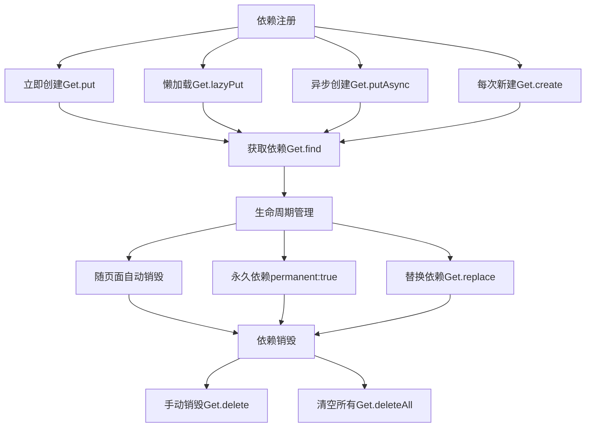
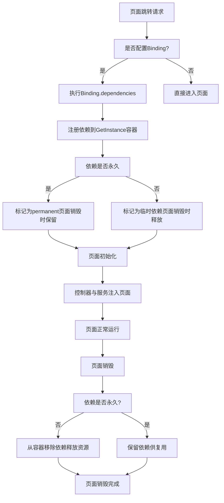

# 🪶序言

## 🧩什么是依赖？
>**依赖** 就是一个对象运行时需要用到的另一个对象。

**例子：**

```dart
class Car {
  Engine v8 = Engine(); // Car 依赖 Engine
}
```

`Car` 离不开 `Engine`，这就是`依赖关系`。

## ⚙️ 什么是依赖注入？

> **依赖注入** 就是把对象的创建交给外部系统（或框架）完成。

简单说：
👉 让别人帮我 `new`，而不是我自己 `new`。

**例子：**

```dart
class Car {
  final Engine v8;
  Car(this.v8); // 依赖由外部注入
}
```

>💡**优点**：
>-   **解耦**：Car 不关心 Engine 怎么创建
>-   **可替换**：方便测试或更换实现类

# GetX - 依赖管理（Dependency Management）

## 1. 基本概念
**GetX 依赖管理**是一种框架机制，用于**统一创建、提供、访问和销毁对象**，实现对象的**集中管理和生命周期控制**。

它让你不用在代码里到处写 `new`，而是由框架帮你管理对象的生命周期。

### 核心思想

1.  **注入（Injection）**
    框架帮你创建对象，你只负责使用，不关心对象如何生成。
    🔹 就像你去餐厅，只需要吃菜，不需要自己下厨。
1.  **管理（Management）**
    框架管理对象的生命周期：自动销毁、永久存在或手动替换。
1.  **访问（Access）**
    注册过的对象可以在任何地方获取，无需传参或重复创建。

> 💡**总结：**
> 框架帮你 new、管你用、自动收拾。<br>
> 这就是 GetX 依赖管理的精髓。

**完整流程示意图如下：**


## 2. 依赖注册
### ①. Get.put

-   **功能**：立即实例化并注册依赖。
-   **使用场景**：应用启动或页面打开时就需要用到的依赖。
-   **参数**：

| 参数名          | 类型                           | 是否必填 | 默认值     | 说明                                                  |
| ------------ | ---------------------------- | :----: | :-------: | --------------------------------------------------- |
| `dependency` | `S`                          | ✅   | —       | 要注册的依赖对象实例，例如控制器或服务类对象。                             |
| `tag`        | `String`                     | ❌   | `null`  | 可选标签，用于区分同一类型的多个实例，常用于多控制器并存场景。                     |
| `permanent`  | `bool`                       | ❌   | `false` | 是否永久依赖：<br>`true` → 对象不会随页面销毁（常驻内存）<br>`false` → 页面销毁时自动释放。 |
| `builder`    | `InstanceBuilderCallback<T>` | ❌   | `null`  | 可选回调，用于懒加载或自定义对象的创建逻辑（一般不与 `dependency` 同时使用）。      |

-   **示例**：

```dart
Get.put(HomeController(), tag: "home", permanent: false);
```

### ②. Get.lazyPut

-   **功能**：懒加载，仅在第一次使用时创建实例。
-   **使用场景**：控制器或服务不是每次都需要时，节省内存资源。
-   **参数**：

| 参数名       | 类型             | 是否必填 | 默认值     | 说明                                                                      |
| --------- | -------------- | :----: | :-------: | ----------------------------------------------------------------------- |
| `builder` | `S Function()` | ✅   | —       | 必选回调，用于创建依赖对象，第一次使用时才会执行。                                               |
| `tag`     | `String`       | ❌   | `null`  | 可选标签，用于区分同一类型的多个实例。                                                     |
| `fenix`   | `bool`         | ❌   | `false` | 是否开启“复活”功能：<br>`true` → 对象被释放后再次调用 `Get.find` 会重新创建<br>`false` → 对象被释放后再次调用会报错。 |

-   **示例**：

```dart
Get.lazyPut<HomeController>(() => HomeController(), tag: "home", fenix: true);
```

### ③. Get.putAsync

-   **功能**：用于异步实例化依赖对象。
-   **使用场景**：当对象创建需要异步操作（如数据库初始化、网络加载等）。
-   **参数**：

| 参数名         | 类型                     | 是否必填 | 默认值     | 说明                                            |
| ----------- | ---------------------- | :----: | :-------: | --------------------------------------------- |
| `builder`   | `Future<S> Function()` | ✅   | —       | 必选异步回调，用于创建对象。                                |
| `tag`       | `String`               | ❌   | `null`  | 可选标签，用于区分同一类型的多个实例。                           |
| `permanent` | `bool`                 | ❌   | `false` | 是否永久依赖：<br>`true` → 对象不会随页面销毁<br>`false` → 页面销毁时自动释放。 |

-   **示例**：

```dart
Get.putAsync<HomeController>(
  () async {
    await Future.delayed(Duration(seconds: 1));
    return HomeController();
  },
  tag: "home",
  permanent: false,
);
```

* * *

### ④. Get.create

-   **功能**：每次调用 `Get.find` 都会创建一个新的实例。
-   **使用场景**：适用于需要临时对象或频繁刷新实例的场景。
-   **参数**：

| 参数名         | 类型             | 是否必填 | 默认值    | 说明                                              |
| ----------- | -------------- | :----: | :------: | ----------------------------------------------- |
| `builder`   | `S Function()` | ✅ | —      | 必选回调，用于每次创建新的依赖对象。                              |
| `tag`       | `String`       | ❌ | `null` | 可选标签，用于区分同一类型的多个实例。                             |
| `permanent` | `bool`         | ❌ | `true` | 是否永久依赖：<br>`true` → 默认值，对象不会随页面销毁<br>`false` → 对象随页面销毁。 |

-   **示例**：

```dart
Get.create<HomeController>(() => HomeController(), tag: "home", permanent: true);
```
### 总结
方法                    | 注册时机               | 返回实例      | 是否可重复创建          | 常用场景                               | 主要参数说明                                           |
| --------------------- | ------------------ | --------- | :----------------: | ---------------------------------- | ------------------------------------------------ |
| **`Get.put<T>`**      | 立即注册（立即创建对象）       | 单例（同类型唯一） | ❌               | 需要立即使用的控制器或服务                      | `dependency`: 实例对象<br>`tag`: 区分实例<br>`permanent`: 是否永久存在 |
| **`Get.lazyPut<T>`**  | 延迟注册（首次使用时创建）      | 单例（惰性加载）  | ✅ (可通过 `fenix` 重建) | 仅在用到时才创建的控制器                       | `builder`: 对象构造函数<br>`fenix`: 被销毁后是否可重建<br>`tag`: 标签标识   |
| **`Get.putAsync<T>`** | 异步注册（等待 Future 完成） | 单例        | ❌               | 需要异步初始化的依赖（如数据库、SharedPreferences） | `builder`: 异步构造函数<br>`permanent`: 是否永久存在<br>`tag`: 标签    |
| **`Get.create<T>`**   | 每次调用时创建新实例         | 非单例（每次新的） | ✅               | 每次都要新建实例的对象                        | `builder`: 构造函数<br>`tag`: 标签<br>`permanent`: 是否永久存在

## 3. 依赖获取

在 **GetX** 中，已经注册的依赖对象可以通过 `Get.find<T>()` 在任何地方获取，无需手动传递或 new 对象。

### ①. 基本用法

```dart
// 获取默认注册的依赖对象
final homeController = Get.find<HomeController>();

// 如果注册时使用了 tag，需要传入相同标签
// tag: 可选标签，用于区分同一类型的多个实例
final loginController = Get.find<HomeController>(tag: "loginPage");
```

### ②. 特点概述

-   **全局访问**：注册后的对象可以在任意地方调用 `Get.find` 获取
-   **类型安全**：泛型保证返回对象类型正确
-   **支持标签**：区分同一类型的多个实例
-   **生命周期一致**：获取到的对象遵循注册时的生命周期规则

### ③. 补充说明

-   获取依赖对象时，如果对象不存在，会抛出异常
-   对于懒加载对象（`Get.lazyPut`）或异步对象（`Get.putAsync`），第一次 `Get.find` 会触发创建

## 4. 依赖销毁

在 **GetX** 中，依赖对象不仅可以自动销毁（随页面生命周期），也可以 **手动销毁** 或 **全部清空** ，从而实现灵活的内存与资源管理。

### ①. Get.delete

-   **功能**：手动销毁指定类型的依赖对象。
-   **使用场景**：当对象不再需要时手动释放资源，或在页面关闭后主动清理。
-   **参数**：

| 参数名     | 类型       | 是否必填 | 默认值     | 说明                                                                 |
| ------- | -------- | :----:|:-------:| ------------------------------------------------------------------ |
| `tag`   | `String` | ❌ | `null`  | 如果注册时使用了标签，销毁时也需传入相同标签。                                            |
| `force` | `bool`   | ❌ | `false` | 是否强制销毁：`true` → 即使对象被标记为 `permanent` 也会被移除`false` → 默认值，永久依赖不会被销毁。 |

-   **示例**：

```dart
// 销毁默认依赖对象
Get.delete<HomeController>();

// 销毁带标签的依赖对象
Get.delete<HomeController>(tag: "home");

// 强制销毁永久依赖
Get.delete<HomeController>(force: true);
```

### ②. Get.deleteAll

-   **功能**：一次性清空所有已注册的依赖对象。
-   **使用场景**：适用于应用重启、退出登录、清理缓存等场景。
-   **示例**：

```dart
// 清空所有依赖对象
Get.deleteAll();
```

### ③. 自动销毁机制

-   当依赖注册时未设置 `permanent: true`，对象会**随页面关闭自动销毁**
-   若设置 `permanent: true`，则必须手动销毁才能释放资源

> 💡 **总结：**
> - `Get.delete` 用于销毁单个依赖
> - `Get.deleteAll` 用于清空全部依赖，默认依赖会随页面自动释放。

## 5. 依赖替换
`Get.replace` 是 **GetX 中用于替换已注册依赖对象** 的方法。它的作用是把原来的依赖对象换成新的实例，而不需要手动先删除再注册,可以理解为 **更新容器里的依赖** 。

-   **功能**：
    -   替换已有依赖对象实例
    -   保持依赖容器中类型和标签不变
    -   自动处理生命周期（会销毁旧对象，注册新对象）
-   **使用场景**：
    1.  **热重载或刷新控制器:**  页面逻辑变更，需要新的实例覆盖旧实例。
    1.  **动态切换服务实现:** 比如切换网络请求客户端、用户数据服务等。
    1.  **替换依赖而不影响其他地方调用:** `Get.find<HomeController>()` 依然能获取到新实例。

-   **示例**：
```dart
// 原来的控制器
Get.put<HomeController>(HomeController());

// 替换成新实例
Get.replace<HomeController>(HomeController());

// 如果原来注册时用了 `tag` 或 `permanent`，可以一起替换：
Get.replace<HomeController>(
  HomeController(),
  tag: "home",
  permanent: true,
);
```

## 6. Bindings
**Bindings** 是 GetX 中的 **依赖注入** 的 `桥梁`，用于在页面加载前自动注册所需的控制器和服务。
它把依赖的创建逻辑从页面中分离出来，实现页面与依赖的**解耦**和**自动管理**。
> Bindings 就是「页面加载前，自动执行依赖注册」的机制。

### ①. 基本使用
#### (1) 定义 Binding 类

通过继承 `Bindings` 并重写 `dependencies()` 方法注册依赖。

```dart
class HomeBinding extends Bindings {
  @override
  void dependencies() {
    // 懒加载控制器
    Get.lazyPut<HomeController>(() => HomeController());

    // 永久依赖的全局服务
    Get.put<AuthService>(AuthService(), permanent: true);
  }
}
```

#### (2) 路由中绑定 Binding

```dart
GetPage(
  name: '/home',
  page: () => HomePage(),
  binding: HomeBinding(),
);
```

当用户进入 `/home` 页面时，`HomeBinding.dependencies()` 会自动执行，
`HomeController` 和 `AuthService` 会被注册到依赖管理容器中。

#### (3) 多 Binding 绑定

```dart
GetPage(
  name: '/dashboard',
  page: () => DashboardPage(),
  bindings: [
    HomeBinding(),
    UserBinding(),
    SettingBinding(),
  ],
);
```

#### (4) 动态绑定（BindingsBuilder）

适合小页面或一次性绑定：

```dart
GetPage(
  name: '/login',
  page: () => LoginPage(),
  binding: BindingsBuilder(() {
    Get.put(LoginController());
  }),
);
```
### ②. 机制原理
**展示：**

**核心机制说明：**

1.  **路由检测阶段**
    当执行 `Get.to()` 或 `Get.off()` 跳转页面时，GetX 会检查目标 `GetPage` 是否配置了 `binding`。
1.  **依赖注册阶段**
    若存在绑定，框架会自动调用该 `Binding` 的 `dependencies()` 方法，将其中定义的依赖通过
    `Get.put()`、`Get.lazyPut()` 等方法注册进 **全局依赖容器** `GetInstance()`。
1.  **页面初始化阶段**
    页面构建时，注册的依赖对象被自动注入（如控制器、服务等），页面可直接通过 `Get.find()` 获取实例。
1.  **页面销毁阶段**
    当页面被关闭时，所有 `permanent = false` 的依赖会自动释放；
    仅有 `permanent = true` 的依赖会常驻内存，直到手动删除或程序结束。

## 7. 管理机制

GetX 的依赖管理机制通过 `SmartManagement` 控制依赖对象在页面生命周期中的自动释放和保留策略。
可以理解为依赖管理的 **智能策略**，决定依赖在页面关闭时是否释放或复用。

### ①. SmartManagement.full

-   **功能**：页面销毁时，**自动释放所有注册的依赖**，包括非 `permanent` 的依赖。
-   **使用场景**：适合页面之间独立、依赖对象不需要跨页面复用的场景。
-   **示例**：
```dart
GetMaterialApp(
  initialRoute: '/home',
  smartManagement: SmartManagement.full,
  getPages: [...],
);
```
-   **特点**：
    -   页面关闭时，非永久依赖全部释放
    -   控制器不会残留，节省内存
    -   默认策略

### ②. SmartManagement.onlyBuilders

-   **功能**：页面销毁时，只释放 **通过 GetBuilder 创建的依赖**，`Get.put` / `Get.lazyPut` 的依赖保持不变。
-   **使用场景**：希望保留全局或懒加载依赖，仅释放页面局部依赖时使用。
-   **示例**：
```dart
GetMaterialApp(
  smartManagement: SmartManagement.onlyBuilders,
);
```
-   **特点**：
    -   页面关闭时只清理局部依赖
    -   全局依赖、懒加载依赖不会被销毁
    -   适合控制器跨页面复用的场景

### ③. SmartManagement.keepFactory

-   **功能**：页面销毁时，**依赖保持不释放**，页面再次打开时复用原实例。
-   **使用场景**：依赖对象需要在多个页面间共享，或者页面频繁切换时希望避免重复创建。
-   **示例**：
```dart
GetMaterialApp(
  smartManagement: SmartManagement.keepFactory,
);
```
-   **特点**：
    -   页面关闭不会销毁依赖
    -   所有依赖都可以跨页面复用
    -   适合全局服务或单例控制器

### 总结对比

| 策略           | 页面销毁行为               | 适用场景        |
| :------------: | -------------------- | ----------- |
| `full`         | 非永久依赖全部释放            | 页面独立，节省内存   |
| `onlyBuilders` | 只释放 GetBuilder 创建的依赖 | 保留全局或懒加载依赖  |
| `keepFactory`  | 所有依赖保留，不释放           | 跨页面复用，单例控制器 |

## 8. 依赖作用域

在 **GetX** 中，依赖对象的作用域决定了对象 **生命周期、可访问性和复用方式**。<br>
主要分为 **页面局部依赖** 和 **全局依赖**。

### ①. 页面局部依赖（Page Scoped Dependency）

-   **定义**：依赖对象只在当前页面存在，页面关闭后自动销毁。

-   **注册方式**：

    -   `Get.put(controller)`（默认 `permanent: false`）
    -   `Get.lazyPut(controller)`（默认非永久）

-   **特点**：

    -   生命周期绑定页面
    -   节省内存，页面关闭后自动释放
    -   不同页面可以注册同类型控制器而互不影响

### ②. 全局依赖（Global Dependency）

-   **定义**：依赖对象在应用整个生命周期中存在，跨页面可复用。

-   **注册方式**：

    -   `Get.put(controller, permanent: true)`
    -   `Get.lazyPut(controller, fenix: true)`（复活机制，释放后可再次创建）

-   **特点**：

    -   生命周期跨页面
    -   多页面共享同一个实例
    -   适合全局服务、单例控制器

### 总结

| 类型     | 生命周期      | 跨页面访问 | 常用场景              |
| ------ | --------- | :-----: | ----------------- |
| 页面局部依赖 | 页面关闭销毁    | ❌     | 页面专属控制器或服务        |
| 全局依赖   | 程序生命周期/永久 | ✅     | 用户状态管理、全局服务、单例控制器 |

---

[原文发布于 CSDN](https://blog.csdn.net/m0_70561094/article/details/153413176)
