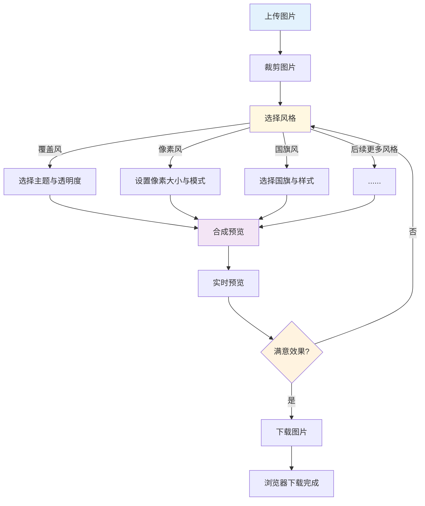

# 前言

相信大家在节假日中，总能发现，大家的头像的覆上了一层节日限定皮肤，那一下节日氛围就满满的了！🎊🎊🎊

<p align="center"> </p>

自然而然，就衍生出了，下面那些头像制作网站，帮你赶时髦。

<p align="center">

 
</p>

但那些远远不够丰富和完善，你为不同的效果到处奔波，甚至还要付费时，就些许狼狈了。<br>
因此我要打造一款功能`更强大`、`更丰富`、`开源免费`的头像制作`插件`！

<p align="center"> </p>

# 设计

## 概述


`FuncAvatar` 是一款专为个性化头像制作而设计的浏览器插件。它集成了多种创意风格处理功能，让用户能够轻松地将普通头像转换为独特的艺术作品。

> <br>`🎪 适用场景:`
>
> *   **社交媒体**：为微信、QQ、微博等平台制作个性头像
> *   **节日庆祝**：快速制作节日主题头像
> *   **游戏娱乐**：创建复古像素风格的游戏头像
> *   **爱国情感**：添加国旗元素展示爱国情怀

## 流程图



## 项目结构

    FuncAvatar/
    ├── manifest.json              # 插件配置文件
    ├── background.js              # 后台服务脚本
    ├── popup.html                 # 插件弹窗界面
    ├── popup.css                  # 插件专用样式
    ├── js/                        # JavaScript模块
    │   ├── init.js                # 初始化脚本
    │   ├── core/                  # 核心模块
    │   │   └── AvatarMaker.js     # 主控制器类
    │   ├── handlers/              # 功能处理模块
    │   │   ├── ImageHandler.js    # 图片处理
    │   │   ├── CropHandler.js     # 图片裁剪
    │   │   ├── ThemeHandler.js    # 主题覆盖
    │   │   ├── PixelHandler.js    # 像素风格
    │   │   └── FlagHandler.js     # 国旗风格
    │   └── ui/                    # UI控制模块
    │       └── UIController.js    # 界面控制器
    ├── icons/                     # 插件图标
    │   ├── ...
    ├── images/                    # 主题图片资源
    │   ├── ...
    ├── flag/                      # 标准国旗图片
    │   ├── ...
    ├── flag-fly/                  # 飘动效果国旗图片
    │   ├── ...
    └── README.md                  # 说明文档

# 实现

## 上传

<p align="center">
    
    
</p>

`上传` 就是上传头像的过程。用户上传图片后弹出裁剪窗口，可通过拖拽或缩放调整裁剪区域，系统记录裁剪比例，最终生成裁剪后的图片并更新预览。

**核心代码：**

```js
this.cropData = {
    x: 0,      // 相对于图片左上角的比例位置 (0~1)
    y: 0,
    width: 0,  // 裁剪区域宽度比例
    height: 0
};

// 更新裁剪数据（计算比例）
updateCropData() {
    const imageRect = this.cropImage.getBoundingClientRect();
    const boxRect = this.cropBox.getBoundingClientRect();

    this.cropData = {
        x: (boxRect.left - imageRect.left) / imageRect.width,
        y: (boxRect.top - imageRect.top) / imageRect.height,
        width: boxRect.width / imageRect.width,
        height: boxRect.height / imageRect.height
    };
}
```

```js
// 拖拽裁剪框移动
dragCropBox(event) {
    let newLeft = event.clientX - this.dragStart.x;
    let newTop = event.clientY - this.dragStart.y;

    // 限制在图片范围内
    newLeft = Math.max(minLeft, Math.min(maxLeft, newLeft));
    newTop = Math.max(minTop, Math.min(maxTop, newTop));

    this.cropBox.style.left = newLeft + 'px';
    this.cropBox.style.top = newTop + 'px';
    this.updateCropData();
}
```

```js
// 调整裁剪框大小（保持正方形）
resizeCropBox(event) {
    const mouseX = event.clientX;
    const mouseY = event.clientY;

    // 根据拖动方向调整宽高
    switch (this.resizeHandle) {
        case 'nw': ...; break;
        case 'ne': ...; break;
        case 'sw': ...; break;
        case 'se': ...; break;
    }

    // 保持正方形
    const size = Math.min(newWidth, newHeight);
    newWidth = newHeight = Math.max(50, size);

    this.cropBox.style.width = newWidth + 'px';
    this.cropBox.style.height = newHeight + 'px';
    this.updateCropData();
}
```

```js
// 生成裁剪后图片
createCroppedImage() {
    const canvas = document.createElement('canvas');
    const ctx = canvas.getContext('2d');
    const size = 400;
    canvas.width = size;
    canvas.height = size;

    const img = this.cropImage;
    const cropX = this.cropData.x * img.naturalWidth;
    const cropY = this.cropData.y * img.naturalHeight;
    const cropW = this.cropData.width * img.naturalWidth;
    const cropH = this.cropData.height * img.naturalHeight;

    ctx.drawImage(img, cropX, cropY, cropW, cropH, 0, 0, size, size);

    const croppedImageUrl = canvas.toDataURL();
    this.app.croppedImageUrl = croppedImageUrl;
    this.app.updatePreview();
}

```

## 覆盖风
<p align="center">
    
         
     
    
</p>

`覆盖风` 是一种将喜爱的效果图叠加在头像上方的风格，通过调节渐变的浓度与方向，使头像与效果图自然融合，呈现出理想的视觉效果。<br>在 `FuncAvatar` 中，覆盖风功能：

*   **预设主题**：
    *   **春节主题** 🧧：春节元素装饰
    *   **中秋主题** 🌕：中秋节庆装饰效果
    *   **生日主题** 🎂：生日庆祝装饰
    *   **国庆主题** 🎊：国庆节庆装饰
*   **自定义主题**：支持上传自定义装饰图片
*   **透明度调节**：可调整装饰效果的透明度
*   **渐变方向**：可调整透明度的渐变方向
    *   从左向右
    *   从右向左
    *   从上向下
    *   从下向上
    *   从中心向四周
    *   从四周向中心

**核心代码：**

```js
 // 渐变效果绘制
 applyOverlayWithGradient(ctx, size) {
        if (!this.overlayImage) return;

        // 获取渐变方向和透明度
        const gradientDirection = document.getElementById('gradientDirection')?.value || 'left-to-right';
        const opacity = this.opacity / 100; // 透明度控制效果强烈程度

        // 创建临时画布用于绘制渐变效果
        const tempCanvas = document.createElement('canvas');
        tempCanvas.width = size;
        tempCanvas.height = size;
        const tempCtx = tempCanvas.getContext('2d');

        // 先在临时画布上绘制覆盖图片
        tempCtx.drawImage(this.overlayImage, 0, 0, size, size);

        // 创建透明度渐变
        let gradient;
        switch (gradientDirection) {
            case 'left-to-right':
                gradient = tempCtx.createLinearGradient(0, 0, size, 0);
                gradient.addColorStop(0, `rgba(255, 255, 255, ${opacity})`);  // 左侧不透明
                gradient.addColorStop(1, `rgba(255, 255, 255, 0)`);           // 右侧透明
                break;
            case 'right-to-left':
                gradient = tempCtx.createLinearGradient(size, 0, 0, 0);
                gradient.addColorStop(0, `rgba(255, 255, 255, ${opacity})`);  // 右侧不透明
                gradient.addColorStop(1, `rgba(255, 255, 255, 0)`);           // 左侧透明
                break;
            case 'top-to-bottom':
                gradient = tempCtx.createLinearGradient(0, 0, 0, size);
                gradient.addColorStop(0, `rgba(255, 255, 255, ${opacity})`);  // 顶部不透明
                gradient.addColorStop(1, `rgba(255, 255, 255, 0)`);           // 底部透明
                break;
            case 'bottom-to-top':
                gradient = tempCtx.createLinearGradient(0, size, 0, 0);
                gradient.addColorStop(0, `rgba(255, 255, 255, ${opacity})`);  // 底部不透明
                gradient.addColorStop(1, `rgba(255, 255, 255, 0)`);           // 顶部透明
                break;
            case 'center-to-edge':
                gradient = tempCtx.createRadialGradient(size/2, size/2, 0, size/2, size/2, size/2);
                gradient.addColorStop(0, `rgba(255, 255, 255, ${opacity})`);  // 中心不透明
                gradient.addColorStop(1, `rgba(255, 255, 255, 0)`);           // 边缘透明
                break;
            case 'edge-to-center':
                gradient = tempCtx.createRadialGradient(size/2, size/2, size/2, size/2, size/2, 0);
                gradient.addColorStop(0, `rgba(255, 255, 255, ${opacity})`);  // 边缘不透明
                gradient.addColorStop(1, `rgba(255, 255, 255, 0)`);           // 中心透明
                break;
            default:
                gradient = tempCtx.createLinearGradient(0, 0, size, 0);
                gradient.addColorStop(0, `rgba(255, 255, 255, ${opacity})`);
                gradient.addColorStop(1, `rgba(255, 255, 255, 0)`);
        }

        // 应用渐变透明度遮罩
        tempCtx.globalCompositeOperation = 'destination-in';
        tempCtx.fillStyle = gradient;
        tempCtx.fillRect(0, 0, size, size);

        // 将处理后的图片绘制到主画布上
        ctx.drawImage(tempCanvas, 0, 0, size, size);
    }
```

## 像素风
<p align="center">
    
    
</p>

`像素风` 是一种将图片进行 **低分辨率化处理** 的视觉效果，它通过减少图片细节、放大像素单元，营造出复古的数字像素感或点阵风格。\
在 `FuncAvatar` 中，像素风主要分为两种模式：

*   **马赛克模式（Block Pixel）** ：以方块为单位对图片取色、平均化，生成经典的像素块效果。
*   **点阵模式（Dot Pixel）** ：用规则排列的小圆点表示图像颜色，模拟显示屏点阵或印刷网点质感。

***

`马赛克模式（Block Pixel）`

**原理：**\
将图像划分为固定大小的方块（`pixelSize`），对每个方块内所有像素的颜色求平均，然后用该平均色填充整个方块，从而形成像素化视觉。

**核心代码：**

```js
applyBlockPixelEffect(canvas, ctx, image) {
    const pixelSize = this.app.pixelSize || 8;
    ctx.clearRect(0, 0, canvas.width, canvas.height);
    ctx.drawImage(image, 0, 0, canvas.width, canvas.height);
    const imageData = ctx.getImageData(0, 0, canvas.width, canvas.height);
    const data = imageData.data;
    ctx.clearRect(0, 0, canvas.width, canvas.height);

    for (let y = 0; y < canvas.height; y += pixelSize) {
        for (let x = 0; x < canvas.width; x += pixelSize) {
            let r = 0, g = 0, b = 0, a = 0, count = 0;
            for (let dy = 0; dy < pixelSize && y + dy < canvas.height; dy++) {
                for (let dx = 0; dx < pixelSize && x + dx < canvas.width; dx++) {
                    const i = ((y + dy) * canvas.width + (x + dx)) * 4;
                    r += data[i]; g += data[i + 1]; b += data[i + 2]; a += data[i + 3];
                    count++;
                }
            }
            if (count > 0) {
                r = Math.round(r / count);
                g = Math.round(g / count);
                b = Math.round(b / count);
                a = Math.round(a / count);
                ctx.fillStyle = `rgba(${r},${g},${b},${a / 255})`;
                ctx.fillRect(x, y, pixelSize, pixelSize);
            }
        }
    }
}
```

***

`点阵模式（Dot Pixel）`

**原理：**\
通过在规则间距的网格点上取图像颜色，并以小圆点绘制出来。\
用户可调整点间距（`dotSpacing`）与点半径（`dotRadius`），以获得更稀疏或更密集的点阵效果。

**核心代码：**

```js
applyDotPixelEffect(canvas, ctx, image) {
    const dotSpacing = this.app.dotSpacing || 6;
    const dotRadius = this.app.dotRadius || 3;
    ctx.clearRect(0, 0, canvas.width, canvas.height);

    const tempCanvas = document.createElement('canvas');
    const tempCtx = tempCanvas.getContext('2d');
    tempCanvas.width = canvas.width;
    tempCanvas.height = canvas.height;
    tempCtx.drawImage(image, 0, 0, canvas.width, canvas.height);

    const imageData = tempCtx.getImageData(0, 0, canvas.width, canvas.height);
    const data = imageData.data;

    for (let y = dotRadius; y < canvas.height; y += dotSpacing) {
        for (let x = dotRadius; x < canvas.width; x += dotSpacing) {
            const i = (y * canvas.width + x) * 4;
            const [r, g, b, a] = [data[i], data[i+1], data[i+2], data[i+3]];
            if (a > 0) {
                ctx.fillStyle = `rgba(${r},${g},${b},${a / 255})`;
                ctx.beginPath();
                ctx.arc(x, y, dotRadius, 0, Math.PI * 2);
                ctx.fill();
            }
        }
    }
}
```

## 国旗风
<p align="center">
    
    
    
      </p>

`国旗风` 是一种通过在头像上添加所选国家国旗元素的风格。用户可根据个人喜好选择不同国旗，并调节显示风格与位置，使头像既保留个性，又能表达对国家的热爱与归属感。<br>在 `FuncAvatar` 中，国旗风功能：

*   **国家国旗**：插件中内含 **254** 个国家旗帜
*   **国旗样式**：
    *   **原样**：正常平面国旗样式
    *   **飘动**：类似波浪形状，飘动的国旗样式
    *   **嵌入**：选取一个圆形裁取国旗核心位置，放置边缘，原图片缩小10%,营造出嵌入效果
*   **国旗位置**：
    *   **左上角**
    *   **右上角**
    *   **左下角**
    *   **右下角**

**核心代码：**

```js
// 国家配置文件
// code     国家代码
// name     国家名称
// cropMode 裁取位置
[
    // 亚洲国家
    { code: 'cn', name: '中国', cropMode: 'center' },
    { code: 'jp', name: '日本', cropMode: 'center' },
    { code: 'kr', name: '韩国', cropMode: 'center' },
    { code: 'kp', name: '朝鲜', cropMode: 'center' },
    ......
]
```

```js
// 原样：将flag内图片在头像图片上展示，根据选择位置变化
applyOriginalStyle(canvas, ctx, flagImage) {
        const flagSize = Math.min(canvas.width, canvas.height) * 0.3; // 国旗大小为画布的30%
        const flagHeight = flagSize * (flagImage.height / flagImage.width); // 实际国旗高度
        const margin = 15; // 统一边距
        const position = this.calculateFlagPosition(canvas, flagSize, flagHeight, margin);

        ctx.drawImage(flagImage, position.x, position.y, flagSize, flagHeight);
    }
```

```js
// 飘动：加载flag-fly下选择国旗的同名图片按位置展示
applyFlyingStyle(canvas, ctx, flagImage) {
    const flagSize = Math.min(canvas.width, canvas.height) * 0.3; // 与原样保持一致的大小
    const flagHeight = flagSize * (flagImage.height / flagImage.width); // 实际国旗高度
    const margin = 15; // 统一边距
    const position = this.calculateFlagPosition(canvas, flagSize, flagHeight, margin);

    ctx.drawImage(flagImage, position.x, position.y, flagSize, flagHeight);
}
```

```js
// 嵌入：根据位置选择在对应角落按圆形截取国旗展示，周围十像素为白色，原头像等比例缩小8%
applyCircleStyle(canvas, ctx, flagImage) {
    const r = 40;               // 国旗圆半径
    const margin = 10;          // 白边
    const totalR = r + margin;

    // 保存原头像并缩小绘制
    const imgData = ctx.getImageData(0, 0, canvas.width, canvas.height);
    ctx.clearRect(0, 0, canvas.width, canvas.height);
    ctx.fillStyle = 'white';
    ctx.fillRect(0, 0, canvas.width, canvas.height);

    const tmp = document.createElement('canvas');
    tmp.width = canvas.width;
    tmp.height = canvas.height;
    tmp.getContext('2d').putImageData(imgData, 0, 0);

    const s = 0.9;
    const off = (1 - s) / 2;
    ctx.drawImage(tmp, 0, 0, canvas.width, canvas.height,
        canvas.width * off, canvas.height * off,
        canvas.width * s, canvas.height * s);

    // 国旗位置
    const pos = {
        'top-left':     { x: totalR, y: totalR },
        'top-right':    { x: canvas.width - totalR, y: totalR },
        'bottom-left':  { x: totalR, y: canvas.height - totalR },
        'bottom-right': { x: canvas.width - totalR, y: canvas.height - totalR }
    }[this.selectedPosition] || { x: totalR, y: totalR };

    // 绘制白底圆
    ctx.save();
    ctx.beginPath();
    ctx.arc(pos.x, pos.y, totalR, 0, 2 * Math.PI);
    ctx.fillStyle = 'white';
    ctx.fill();

    // 剪切圆形区域并绘制国旗
    ctx.beginPath();
    ctx.arc(pos.x, pos.y, r, 0, 2 * Math.PI);
    ctx.clip();

    const size = r * 2;
    const ratio = flagImage.width / flagImage.height;
    let sx, sy, sw, sh;

    if (ratio > 1) {
        sw = sh = flagImage.height;
        sx = (flagImage.width - sw) / 2;
        sy = 0;
    } else {
        sw = sh = flagImage.width;
        sx = 0;
        sy = (flagImage.height - sh) / 2;
    }

    ctx.drawImage(flagImage, sx, sy, sw, sh,
        pos.x - r, pos.y - r, size, size);
    ctx.restore();
}
```

## 下载

<p align="center">
    
    
 </p>

**轻轻一点 收工** 😎

# 嵌入式国旗展示问题

在 `国旗风` 中，因为图片量较多，目前嵌入式风格，有些国旗展示不够 **核心**：
<br>如下图，虽然配置中设置了左裁取，但是因为国旗核心区域的大小等原因，导致效果不理想🥲。
<br>未来打算，专门设置圆形国旗文件夹，存储处理好的圆形国旗，一劳永逸🫡。


# 未来展望
- 添加更多预设的节日主题支持
- 添加更多其他风格玩法
- 拓展多端（Andorid、Ios、Web等）

# 🎟️发车了 🚗

<br>[🚪GitHub - 源码](https://github.com/TheSyart/dxs_demo/tree/master/FuncAvatar)
<br>[🎨FuncAvatar - 在线演示站](http://funcavatar.shanchen.space/)

---

[原文发布于 CSDN](https://blog.csdn.net/m0_70561094/article/details/153729984)
