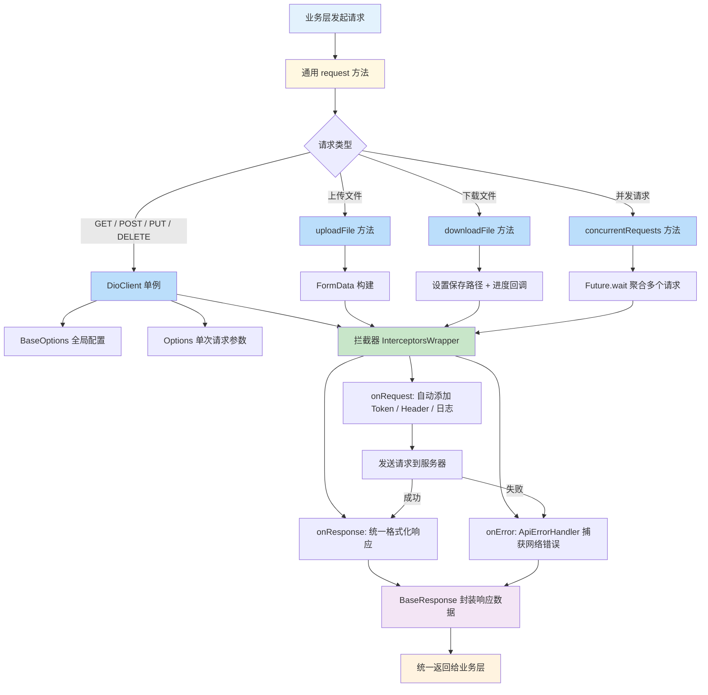

# 🪶序言

## 推古
在原生移动开发的世界里，**网络层** 永远是应用的心脏。
`Android` 开发者几乎离不开 **Retrofit + OkHttp**，
`iOS` 开发者则信赖 **Alamofire**，
<br>这两者共同代表了移动端网络封装的巅峰理念：

> 用优雅的抽象，化繁为简地操作 HTTP。

它们让开发者从底层的 Socket、HttpURLConnection、URLSession 之苦中解放出来，
进入了 **声明式网络请求** 的新时代。

### 📱 Android 最流行的网络库

| 名称                    | 说明                               | 特点                                    |
| --------------------- | -------------------------------- | ------------------------------------- |
| **OkHttp** 🥇         | Google 官方推荐、几乎所有 Android 框架底层都用它 | 高性能、连接池、拦截器机制强大、支持 HTTP/2、WebSocket   |
| **Retrofit**          | 封装在 OkHttp 之上，用注解式接口调用网络         | 简洁优雅，支持 Gson/Moshi 序列化，几乎是 Android 标配 |
| **Volley**            | Google 官方早期网络库                   | 简单轻量，但扩展性差，已被 OkHttp/Retrofit 取代      |
| **HttpURLConnection** | Java 原生类                         | 基础功能，手写麻烦，现代项目几乎不用                    |

### 🍎 iOS 最流行的网络库

| 名称               | 说明                              | 特点                               |
| ---------------- | ------------------------------- | -------------------------------- |
| **Alamofire** 🥇 | Swift 社区最流行的网络库                 | 封装 URLSession，链式调用、支持拦截器和响应序列化   |
| **URLSession**   | Apple 官方原生 API                  | 功能全，但使用繁琐，Alamofire 基于它封装        |
| **AFNetworking** | Alamofire 的 Objective-C 版本（老牌库） | 经典稳定，但现在主流 Swift 项目多转向 Alamofire

## 验今

然而，当跨平台框架 `Flutter` 出现后，
开发者开始追问——

> 有没有一个库，能像 Retrofit 一样强大，又像 Alamofire 一样优雅，
> 还能同时运行在 Android 与 iOS 上？

于是，答案出现了：**Dio** !
<br>一个融合了 Retrofit 的 **结构化思维** 与 Alamofire 的 **优雅语法**，
却在 Dart 异步世界中重生的网络灵魂。

# Dio - 强大的 HTTP 网络请求库

## 一. 基本概念

**Dio** 是一个基于 Dart 语言的强大、灵活的 HTTP 客户端库，主要用于 Flutter 和 Dart 中的网络请求操作。它的设计目标是提供一个高效、简洁、功能丰富的工具来帮助开发者发起 HTTP 请求，并能够处理常见的网络通信任务（如请求、响应、错误处理、数据转换、文件上传/下载等）。

## 二. 项目引入
在项目配置文件 `pubspec.yaml` 添加如下依赖：
```yaml
dependencies:
  dio: ^5.9.0 #进入官网查看最新版本
```
然后点击 **编译器提示** 或 **命令行输入**,完成依赖导入。
```bash
flutter pub get
```

[查看最新版本链接🔗](https://pub-web.flutter-io.cn/packages/dio/install)

## 三. 快速上手

### 1. GET
`GET`请求用于获取资源，支持 URL 参数传递（queryParameters）。
```dart
void request() async {
  Response response;
  // 写法一
  response = await dio.get('/test?id=12&name=dio');
  print(response.data.toString());

  // 写法二
  response = await dio.get(
    '/get',
    queryParameters: {'id': 001, 'name': 'dio'},
  );
  print(response.data.toString());
}
```

### 2. POST
`POST`请求用于发送数据，通常用于创建资源。
```dart
void request() async {
  Response response;
  response = await dio.post('/post', data: {'id': 001, 'name': 'dio'});
  print(response.data.toString());
}
```

### 3. PUT

`PUT` 请求通常用于更新资源，跟 `POST` 的区别是它是幂等的，即相同请求多次不会产生不同的效果。

```dart
void request() async {
  Response response;
  response = await dio.put('/update', data: {'id': 001, 'name': 'dio updated'});
  print(response.data.toString());
}
```

### 4. DELETE

`DELETE` 请求用于删除资源。

```dart
void request() async {
  Response response;
  response = await dio.delete('/delete', queryParameters: {'id': 001});
  print(response.data.toString());
}
```

### 5. FormData（上传文件）

`FormData` 用于处理文件上传和表单数据的提交。Dio 提供了简单的 API 来支持上传文件和其它表单数据。

```dart
void uploadFile() async {
  Response response;
  String filePath = '/path/to/your/file.jpg';

  FormData formData = FormData.fromMap({
    "name": "dio",
    "file": await MultipartFile.fromFile(filePath, filename: "file.jpg"),
  });

  response = await dio.post('/upload', data: formData);
  print(response.data.toString());
}
```
>💡**注意**：还可以通过 `FormData` 上传多个文件
>```dart
>final formData = FormData.fromMap({
>  'name': 'dio',
>  'date': DateTime.now().toIso8601String(),
>  'file': await MultipartFile.fromFile('./text.txt', filename: 'upload.txt'),
>  'files': [
>    await MultipartFile.fromFile('./text1.txt', filename: 'text1.txt'),
>    await MultipartFile.fromFile('./text2.txt', filename: 'text2.txt'),
>  ]
>});
>final response = await dio.post('/upload', data: formData);
>```

### 6. 下载文件

Dio 也支持文件下载，可以通过 `download` 方法来下载文件，并且支持监听下载进度。

```dart
void downloadFile() async {
  String url = "https://example.com/file.zip";
  String savePath = "/path/to/save/file.zip";

  Response response;

  // 文件下载并支持进度回调
  await dio.download(
    url,
    savePath,
    onReceiveProgress: (received, total) {
      if (total != -1) {
        print((received / total * 100).toStringAsFixed(0) + "%");
      }
    },
  );
  print('下载完成');
}
```

### 7. 发起多个并发请求
```dart
List<Response> responses = await Future.wait([dio.post('/info'), dio.get('/token')]);
```

## 四.请求配置
在 Dio 中有两种配置概念：`BaseOptions` 和 `Options`。 `BaseOptions` 描述的是 Dio 实例的一套基本配置，而 `Options` 描述了单独请求的配置信息。 以上的配置会在发起请求时进行合并。

### 1️⃣ BaseOptions 配置属性（全局配置）

| 属性                           | 说明                  | 默认值 / 备注            |
| ---------------------------- | ------------------- | ------------------- |
| `baseUrl`                    | 全局基础 URL，所有请求会基于此拼接 | `''`                |
| `connectTimeout`             | 连接服务器超时             | `null`（不限制）         |
| `sendTimeout`                | 发送请求超时              | `null`（不限制）         |
| `receiveTimeout`             | 接收响应超时              | `null`（不限制）         |
| `headers`                    | 全局请求头               | `null`              |
| `queryParameters`            | 默认查询参数              | `null`              |
| `responseType`               | 响应类型                | `ResponseType.json` |
| `contentType`                | 请求 Content-Type     | `null`              |
| `validateStatus`             | 响应状态码校验函数           | `null`              |
| `receiveDataWhenStatusError` | 是否在请求失败时仍获取响应数据     | `true`              |
| `followRedirects`            | 是否自动跟随重定向           | `true`              |
| `maxRedirects`               | 最大重定向次数             | `5`                 |
| `persistentConnection`       | 是否保持持久连接            | `true`              |
| `extra`                      | 自定义数据，可在拦截器中获取      | `null`              |
| `preserveHeaderCase`         | 是否保留请求头大小写          | `false`             |
| `requestEncoder`             | 自定义请求编码器            | `Utf8Encoder`       |
| `responseDecoder`            | 自定义响应解码器            | `Utf8Decoder`       |
| `listFormat`                 | 集合参数编码方式            | `ListFormat.multi`  |
| `method`                     | 默认 HTTP 方法          | `GET`               |

### 2️⃣ Options 配置属性（单次请求配置）

| 属性                           | 说明                          | 默认值 / 备注                     |
| ---------------------------- | --------------------------- | ---------------------------- |
| `method`                     | 请求方法（GET/POST/PUT/DELETE）   | `null`（使用 BaseOptions 的默认方法） |
| `sendTimeout`                | 当前请求发送超时                    | `null`（使用 BaseOptions 的默认值）  |
| `receiveTimeout`             | 当前请求接收超时                    | `null`（使用 BaseOptions 的默认值）  |
| `headers`                    | 请求头，可覆盖 BaseOptions 中的全局请求头 | `null`                       |
| `extra`                      | 自定义数据，可在拦截器中获取              | `null`                       |
| `preserveHeaderCase`         | 是否保留请求头大小写                  | `null`                       |
| `responseType`               | 响应类型                        | `null`                       |
| `contentType`                | 请求 Content-Type             | `null`                       |
| `validateStatus`             | 判断当前请求状态码是否成功               | `null`                       |
| `receiveDataWhenStatusError` | 是否在请求失败时仍获取响应数据             | `null`                       |
| `followRedirects`            | 是否跟随重定向                     | `null`                       |
| `maxRedirects`               | 最大重定向次数                     | `null`                       |
| `persistentConnection`       | 是否保持持久连接                    | `null`                       |
| `requestEncoder`             | 自定义请求编码器                    | `null`                       |
| `responseDecoder`            | 自定义响应解码器                    | `null`                       |
| `listFormat`                 | 集合参数编码方式                    | `null`                       |

> 📃 **总结**：
>1.  **BaseOptions** → 全局配置，影响整个 Dio 实例的所有请求。
>1.  **Options** → 请求级配置，只影响当前请求，会覆盖 BaseOptions 的同名属性。
>1.  二者结合使用，可以既保证全局统一配置，又支持单次请求灵活定制。

## 五. 拦截器

在 **Dio** 中，每个实例都可以添加多个拦截器，这些拦截器按先进先出的顺序执行。拦截器可以在请求发出之前、响应返回之后或请求出现错误时统一处理逻辑，例如添加 token、统一错误处理、日志打印等。

拦截器主要有三个回调方法：

-   **onRequest**：在请求发送之前触发，可修改请求参数、添加认证信息等。
-   **onResponse**：在收到响应之后触发，可统一处理响应数据或格式化。
-   **onError**：当请求或响应出现错误时触发，用于捕获异常和统一处理错误信息。

* * *

### 1️⃣ 自定义拦截器

你可以继承 `Interceptor` 类，重写 `onRequest`、`onResponse` 和 `onError` 方法，实现自定义逻辑。例如：

```dart
import 'package:dio/dio.dart';

class CustomInterceptors extends Interceptor {
  @override
  void onRequest(RequestOptions options, RequestInterceptorHandler handler) {
    print('➡️ [Request] ${options.method} ${options.uri}');
    // 例如添加统一 token
    options.headers['Authorization'] = 'Bearer YOUR_TOKEN';
    super.onRequest(options, handler);
  }

  @override
  void onResponse(Response response, ResponseInterceptorHandler handler) {
    print('✅ [Response] ${response.statusCode}');
    super.onResponse(response, handler);
  }

  @override
  Future onError(DioException err, ErrorInterceptorHandler handler) async {
    print('❌ [Error] ${err.message}');
    super.onError(err, handler);
  }
}
```

* * *

### 2️⃣ 内置拦截器

#### **LogInterceptor**

-   用于打印请求和响应日志，方便调试。
-   可打印请求 URL、Headers、Body，响应状态码及数据，甚至错误信息。

```dart
  LogInterceptor(
    request: true,
    requestBody: true,
    responseBody: true,
    error: true,
    logPrint: (obj) => print("🧾 DioLog: $obj"),
  );
```

* * *

#### **QueuedInterceptor**

-   请求按队列顺序执行，适用于 token 刷新或顺序请求场景。
-   可以保证同一时间只执行一个请求，避免并发冲突。

```dart
QueuedInterceptor();
```

* * *

#### **InterceptorsWrapper**

-   提供灵活的回调方式，不需要继承 `Interceptor` 类即可实现自定义逻辑。
-   可以一次性处理请求、响应、错误。

```dart
InterceptorsWrapper(
   onRequest: (options, handler) async {
      print('➡️ [Request] ${options.method} ${options.uri}');
      return handler.next(options);
   },
   onResponse: (response, handler) {
      print('✅ [Response] ${response.statusCode}');
      return handler.next(response);
   },
   onError: (e, handler) async {
      print('❌ [Error] ${e.message}');
      return handler.next(e);
   },
);
```

* * *

### 3️⃣ 注册拦截器顺序

**Dio** 会按拦截器注册的顺序执行请求拦截器，并按 **倒序** 执行响应拦截器：

```
请求顺序: Interceptor1 -> Interceptor2 -> ... -> 请求发送
响应顺序: 响应返回 -> Interceptor2 -> Interceptor1
错误顺序: 错误抛出 -> Interceptor2 -> Interceptor1
```

>💡**实践建议**：
>1.  **日志拦截器**放最后，确保打印的是最终请求/响应数据。
>1.  **统一错误处理**拦截器放最前，先捕获异常。
>1.  **Token/认证拦截器**放在请求链前端，保证每个请求都带上必要信息。

* * *

### 4️⃣示例

```dart
final dio = Dio();

// 添加 InterceptorsWrapper
dio.interceptors.add(
  InterceptorsWrapper(
    onRequest: (options, handler) async {
      print('➡️ [Request] ${options.method} ${options.uri}');
      return handler.next(options);
    },
    onResponse: (response, handler) {
      print('✅ [Response] ${response.statusCode}');
      return handler.next(response);
    },
    onError: (DioException e, handler) async {
      print('❌ [Error] ${e.message}');
      return handler.next(e);
    },
  ),
);

// 添加自定义拦截器
dio.interceptors.add(CustomInterceptors());

// 添加其他拦截器...

// 添加日志
dio.interceptors.add(
  LogInterceptor(
    requestBody: true,
    responseBody: true,
    logPrint: (obj) => print("🧾 DioLog: $obj"),
  ),
);

// 请求顺序控制（可选）
QueuedInterceptor();
```

## 六. Dio 封装

在大型 Flutter 项目中，直接使用 `Dio` 进行请求会导致重复代码、错误处理分散、Token 管理不统一。因此，建议封装一个 **单例 Dio 客户端** + **统一拦截器** + **全局错误处理** + **通用请求方法**，提高项目网络层的可维护性和可扩展性。

***

### 流程示意图


* * *

### 1️⃣ 单例 Dio 客户端

```dart
class DioClient {
  static final DioClient _instance = DioClient._internal();
  factory DioClient() => _instance;

  late final Dio dio;
  final controller = Get.find<GetStorageService>();  // 本地存储服务
  late final Map<String, String> info;               // 设备信息

  DioClient._internal() {
    info = controller.getDeviceInfo()!;
    dio = Dio(
      BaseOptions(
        baseUrl: GlobalConfig.apiHost,
        connectTimeout: const Duration(seconds: 5),
        sendTimeout: const Duration(seconds: 8),
        receiveTimeout: const Duration(seconds: 8),
        headers: {
          'Content-Type': 'application/json',
          'User-Agent': info['ua'] ?? 'UnknownUA',
          'OS': info['os'] ?? 'UnknownOS',
        },
      ),
    );

    _addInterceptors(); // 添加统一拦截器
  }
  // 获取 token
  Future<String?> _getToken() async => controller.getToken();
}
```

**📘 说明：**

-   保证全局仅存在一个 `Dio` 实例（单例模式）。
-   初始化时设置基础配置（baseUrl、超时、headers）。
-   自动注入设备信息与 Token 管理（结合 `GetStorageService`）。

**💡 建议：**

> 把设备信息、Token、BaseUrl 等集中管理，后续只需改一处即可影响全局。

* * *

### 2️⃣ 拦截器统一管理
```dart
void _addInterceptors() {
  dio.interceptors.add(
    InterceptorsWrapper(
      onRequest: (options, handler) async {
        // 统一添加 token
        final token = await _getToken();
        if (token != null) options.headers['Authorization'] = 'Bearer $token';
        print('➡️ [Request] ${options.method} ${options.uri}');
        handler.next(options);
      },
      onResponse: (response, handler) {
        print('✅ [Response] ${response.statusCode}');
        handler.next(response);
      },
      onError: (DioException e, handler) async {
        // 统一错误提示
        ApiErrorHandler.handle(e);
        handler.next(e);
      },
    ),
  );

  // 日志拦截
  dio.interceptors.add(
    LogInterceptor(
      requestBody: true,
      responseBody: true,
      logPrint: (obj) => print("🧾 DioLog: $obj"),
    ),
  );
}
```

**📘 说明：**

-   **onRequest**：自动注入 `Token`、打印请求信息。
-   **onResponse**：响应日志记录。
-   **onError**：通过 `ApiErrorHandler` 统一异常展示。
-   **LogInterceptor**：详细记录请求与响应数据，方便调试。

**💡 建议：**

> `LogInterceptor` 放在最后，可打印最终处理后的请求/响应。

* * *

### 3️⃣ 全局错误处理（ApiErrorHandler）

```dart
class ApiErrorHandler {
  static void handle(DioException e) {
    String message = '未知错误';
    int? statusCode = e.response?.statusCode;

    switch (e.type) {
      case DioExceptionType.connectionTimeout:
        message = '连接服务器超时';
        break;
      case DioExceptionType.sendTimeout:
        message = '请求发送超时';
        break;
      case DioExceptionType.receiveTimeout:
        message = '服务器响应超时';
        break;
      case DioExceptionType.cancel:
        message = '请求已取消';
        break;
      case DioExceptionType.badResponse:
        message = _mapStatusCode(statusCode, e.response?.data);
        break;
      default:
        message = e.message ?? '网络连接异常';
    }

    Get.snackbar('请求错误', message);
  }

  static String _mapStatusCode(int? statusCode, dynamic data) {
    switch (statusCode) {
      case 400: return '请求参数错误';
      case 401:
        Get.offAllNamed('/login');
        return '登录过期，请重新登录';
      case 403: return '没有权限访问';
      case 404: return '资源不存在';
      case 408: return '请求超时';
      case 500: return '服务器内部错误';
      case 502: return '网关错误';
      case 503: return '服务器维护中';
      default: return data?['message'] ?? '未知服务器错误';
    }
  }
}
```

**📘 说明：**

-   针对不同类型和状态码的错误返回清晰提示。
-   401 时自动跳转登录页。
-   UI 层统一用 `Get.snackbar` 展示。

**💡 建议：**

> 可以扩展为 `ApiErrorHandler.message(DioException e)` 返回文本提示，用于静默处理或 Toast 展示。

* * *

### 4️⃣ 统一响应模型（BaseResponse）

```dart
class BaseResponse<T> {
  final int code;
  final String message;
  final T? data;

  BaseResponse({required this.code, required this.message, this.data});

  bool get isSuccess => code == 200 || code == 0;

  factory BaseResponse.fromJson(Map<String, dynamic> json, T Function(dynamic json)? fromJsonT) {
    return BaseResponse<T>(
      code: json['code'] ?? -1,
      message: json['message'] ?? '未知错误',
      data: fromJsonT != null ? fromJsonT(json['data']) : json['data'],
    );
  }
}
```

**📘 说明：**

-   所有 API 响应结构化为统一格式。
-   `fromJsonT` 支持泛型解析业务对象。

**💡 建议：**

> 在业务层使用 `response.data` 获取数据时可直接是模型类型，避免手动 `jsonDecode()`。

* * *

### 5️⃣ 自定义异常（ApiException）

```dart
class ApiException implements Exception {
  final int code;
  final String message;

  ApiException(this.code, this.message);

  @override
  String toString() => 'ApiException(code: $code, message: $message)';
}
```

**📘 说明：**

-   所有非 2xx 或业务异常均通过 `ApiException` 抛出。
-   统一捕获并在上层业务逻辑处理。

* * *

### 6️⃣ 通用请求封装

```dart
// 通用请求
Future<BaseResponse<T>> request<T>(
  String path, {
  String method = 'GET',
  dynamic data,
  Map<String, dynamic>? query,
  Options? options,
  T Function(dynamic)? fromJsonT,
}) async {
  try {
    final response = await dio.request(
      path,
      data: data,
      queryParameters: query,
      options: options?.copyWith(method: method) ?? Options(method: method),
    );

    final resJson = response.data is Map<String, dynamic>
        ? response.data
        : Map<String, dynamic>.from(response.data);

    final base = BaseResponse<T>.fromJson(resJson, fromJsonT);

    if (base.isSuccess) {
      return base;
    } else {
      throw ApiException(base.code, base.message);
    }
  } on DioException catch (e) {
    throw ApiException(-1, e.message ?? '请求异常');
  } catch (e) {
    throw ApiException(-1, e.toString());
  }
}

// 快捷方法
Future<BaseResponse<T>> get<T>(...) => request(path, method: 'GET', ...);
Future<BaseResponse<T>> post<T>(...) => request(path, method: 'POST', ...);
Future<BaseResponse<T>> put<T>(...) => request(path, method: 'PUT', ...);
Future<BaseResponse<T>> delete<T>(...) => request(path, method: 'DELETE', ...);
```

> 🔹 这些方法让上层调用更简洁：
>
> ```dart
> final res = await DioClient().get('/user/info', fromJsonT: User.fromJson);
> ```

* * *

### 7️⃣ 文件上传封装

```dart
Future<BaseResponse<T>> uploadFile<T>(
  String path,
  String filePath, {
  Map<String, dynamic>? extraData,
  Function(int, int)? onSendProgress,
  T Function(dynamic)? fromJsonT,
}) async {
  try {
    final formData = FormData.fromMap({
      "file": await MultipartFile.fromFile(filePath),
      ...?extraData,
    });

    final response = await dio.post(
      path,
      data: formData,
      onSendProgress: onSendProgress,
    );

    return BaseResponse<T>.fromJson(response.data, fromJsonT);
  } on DioException catch (e) {
    throw ApiException(-1, e.toString());
  }
}
```

**📘 说明：**

-   支持多参数表单上传（如 `file + extraData`）。
-   可实时监听上传进度（`onSendProgress`）。

* * *

### 8️⃣ 文件下载封装

```dart
Future<void> downloadFile(
  String urlPath,
  String savePath, {
  Function(int, int)? onReceiveProgress,
}) async {
  try {
    await dio.download(
      urlPath,
      savePath,
      onReceiveProgress: onReceiveProgress,
    );
  } on DioException catch (e) {
    throw ApiException(-1, e.toString());
  }
}
```

**📘 说明：**

-   通过 `onReceiveProgress` 获取下载进度，适合结合 `ProgressIndicator`。
-   可拓展断点续传或缓存机制。

* * *

### 9️⃣ 并发请求封装

```dart
Future<List<BaseResponse<T>>> concurrentRequests<T>(
  List<Future<BaseResponse<T>>> futures,
) async {
  try {
    final results = await Future.wait(futures);
    return results;
  } catch (e) {
    rethrow;
  }
}
```

**📘 说明：**

-   并发执行多个请求（如批量加载数据）。
-   利用 `Future.wait`，统一返回所有请求结果。

**💡 示例：**

```dart
final results = await DioClient().concurrentRequests([
  DioClient().get('/user/info'),
  DioClient().get('/user/config'),
]);
```

* * *

## 🧩 总结：Dio 封装层职责划分

| 模块                     | 职责      | 核心要点                   |
| ---------------------- | ------- | ---------------------- |
| **DioClient**          | 单例客户端   | BaseOptions、设备信息、拦截器注册 |
| **拦截器**                | 请求/响应处理 | Token 注入、日志打印、错误统一     |
| **ApiErrorHandler**    | 异常分级管理  | 网络层与业务层错误分离            |
| **BaseResponse**       | 统一响应结构  | 保证解析安全、支持泛型模型          |
| **ApiException**       | 自定义异常类型 | 链路抛出与捕获更统一             |
| **request 封装**         | 统一入口    | 提供通用与快捷方法              |
| **upload / download**  | 文件传输    | 支持进度监听                 |
| **concurrentRequests** | 并发执行    | 提升批量接口性能               |

# 结语

## 插件推荐
Dio 官方列出了许多相关的精选插件，推荐给大家。
<br>[相关插件🔗 地址](https://github.com/cfug/dio/blob/main/dio/README-ZH.md)


## 源码

感谢大家支持🫡🫡🫡

[🧭 Dio 封装源码 地址](https://github.com/TheSyart/dxs_demo/tree/master/dio)

[🚪 大学牲 - 个人门户](http://www.shanchen.space/)

---

[原文发布于 CSDN](https://blog.csdn.net/m0_70561094/article/details/154127844)
