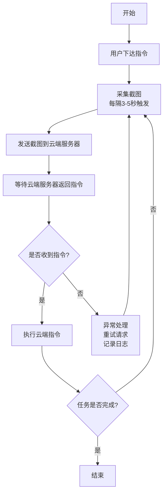

# 前言

`豆包手机` 是 **字节跳动** 与 **中兴** 合作推出的AI手机，售价为 **3499元** 的工程预览版，核心卖点是深度集成了豆包大模型的 `手机助手` 功能，能跨应用自动执行复杂任务，比如比价购物、订机票酒店、处理文档等，让手机从工具变成助手。

硬件上，它搭载骁龙8 Gen3芯片、16GB+512GB存储、6000mAh电池和5000万像素三摄，配置均衡。通过侧边AI键、耳机多种方式唤醒，交互更自然。

# 1.豆包手机如何看见与操作屏幕？

很多人认为，豆包手机看见和操作屏幕，是通过 `手机截屏` 和 `无障碍api` 来实现的。

| 功能           | 接口/权限                            |
| :----------- | :------------------------------- |
| Android 截屏接口 | `media.projection()`             |
| Android 点击屏幕 | 无障碍 API (`AccessibilityService`) |

> Android无障碍API（AccessibilityService）是Android系统提供的特殊服务，旨在帮助残障用户更好地操作设备，同时也支持自动化测试和跨应用交互。其主要功能包括：
>
> *   ‌**模拟操作**‌：通过代码模拟点击、滑动等用户操作。
> *   ‌**界面监控**‌：实时获取应用界面信息，如控件类型和内容。
> *   ‌**辅助功能**‌：为视障、听障等用户提供语音反馈、文字转语音等支持。

***

实则不然，我们看通过抓包得到的数据，分析能得到不少的有用信息：

| 功能     | 权限                                               | 描述                                                             |
| :----- | :----------------------------------------------- | :------------------------------------------------------------- |
| 豆包截图   | `android.permission.READER_FLAME_BUFFER`         | 可以在Gpu渲染的图形缓冲区，直接将渲染的bitmap拿走了。                                |
| 豆包获取视频 | `android.permission.CAPTURE_SECURE_VIDEO_OUTPUT` | 这是一个**系统级签名权限**，普通应用无法获取。它允许应用捕获安全的视频输出（例如受DRM保护的内容或某些安全屏幕的内容） |
| 豆包模拟点击 | `android.permission.INJECT_EVENTS`               | 模拟屏幕点击，通过注入输入事件。                                               |

通过对比可以明显看出，豆包手机所使用的 `READER_FLAME_BUFFER`、`CAPTURE_SECURE_VIDEO_OUTPUT` 和 `INJECT_EVENTS` 均为**系统级权限**。这类权限通常只预置在系统应用或经过设备制造商特殊授权的应用中，大多数 AI 应用无法通过常规申请获得。这证明豆包并非依赖标准的上层 API，而是**获得了底层的、系统级的深度集成与支持**，从而具备了超越常规AI应用的屏幕读取和交互能力。

# 2.豆包手机执行任务是在后台运行的吗？
当你一边玩手机的时候，豆包一边干活的时候，你是不是觉得它一定是在后台运行的，那么你就又错了。

同样你从这段抓出的信息，上面是正常屏幕的输出信息，而下面是豆包屏幕的输出信息，你可以看到：
- `拥有者`：**owner com.obric.autoaction**
- `屏幕大小`：**1264 x 2800**
- `屏幕亮度`：**brightnessMinmum 0.0 , brightnessMaximum 0.0 , brightnessDefault 0.0**
- `fps`: **60**
- `受信任`: **FLAG_TRUSTED**
- `永远解锁`: **FLAG_ALAWAYS_UNLOCKED**
- `独占焦距`: **FLAG_OWN_FOCUS**

因此，豆包的是无头屏幕，而不是后台运行，与用户分别独享焦点互不打扰的屏幕

# 3.豆包手机执行任务是什么个流程？

运行流程我们就从日志一步步向下看，首先最显眼的就是这个请求了 `http://ofa.obriccloud.com/auto_action/api/task/inferenc`,我们拆分一下：
- 服务器域名：`ofa.obriccloud.com`
- 推理接口：`/auto_action/api/task/inference`

然后我们查一下，域名的备案主体是`北京春田知韵科技有限公司` 。这么一看，你可能不知道它是谁，但是你在网上一搜。

哎！一下就清晰了。

***

再看请求返回的信息，都包含一个 `action_type` 动作类型，统计之后大致是如下七种：

| 指令       | 功能说明     |
|------------|------------|
| open_app   | 打开应用     |
| click      | 点击屏幕     |
| type       | 输入文本     |
| wait       | 等待         |
| swipe      | 滑动屏幕     |
| take_notes | 记笔记       |
| stop       | 停止         |

***

把上面的信息一整理,再结合每次请求的 `时间戳`，自然而然你就得出了这个流程。

---

[原文发布于 CSDN](https://blog.csdn.net/m0_70561094/article/details/155827109)
