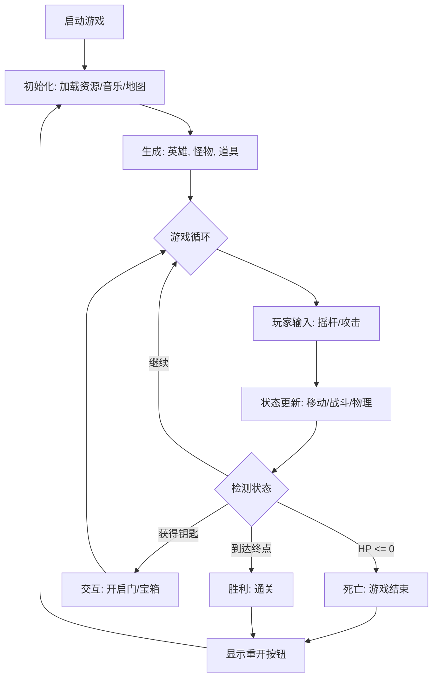

[Flutter 勇闯2D像素游戏之路（一）：一个 Hero 的诞生](https://juejin.cn/post/7579264485259411471)\
[Flutter 勇闯2D像素游戏之路（二）：绘制加载游戏地图](https://juejin.cn/post/7581025279646892070)\
[Flutter 勇闯2D像素游戏之路（三）：人物与地图元素的交互](https://juejin.cn/post/7584014975242911754)\
[Flutter 勇闯2D像素游戏之路（四）：与哥布林战斗的滑步魔法师](https://juejin.cn/post/7585463258691125257)\
[Flutter 勇闯2D像素游戏之路（五）：像元气骑士一样的设计随机地牢](https://juejin.cn/post/7588022226739200050)

# 前言

在上篇文章中,我们完成了和 **地图元素** 的交互，`开箱、开门、被刺扎` 无所不精。\
那么本章给大家介绍,一款游戏的精髓 **对战** 相关元素的实现。
这一元素类比 **谈恋爱**，可以说是，给大多数玩家的`第一印象` 了。

## 对战元素的重要性

| 维度 | 对战元素的作用 | 对游戏的影响 |
|------|----------------|--------------|
| 玩家存在感 | 操作能立刻产生命中、受伤、击杀得到正反馈 | 强化`游戏世界` 的真实感 |
| 游戏节奏 | 形成紧张（战斗）与放松（探索/叙事）的结合 | 避免节奏单一，降低疲劳感 |
| 决策决断 | 引入风险与回报（打/绕、进/退、用/留） | 从执行操作升级为策略选择 |
| 重复可玩性 | 敌人组合、走位、战况具有不确定性 | 提高重玩价值，延长游戏寿命 |
| 情绪驱动 | 胜利、失败、逆转带来情绪波动 | 增强成就感与沉浸感 |

> **总结**：
对战元素并不只是 `战斗机制`，而是连接玩家行为、系统设计与情绪体验的 **核心枢纽**，决定了一款游戏是否真正具备持续吸引力。

> **github源码** 和 **游戏在线体验地址**（体验版为网页，可能手感较差，推荐源码安装至手机体验） 皆在文章最后。

# Myhero

## 一. 本章目标


## 二. 实现 `HUD` 面板


**HUD**（Heads-Up Display，抬头显示）是始终 **固定在屏幕上** 的游戏界面层，用于向玩家展示信息并接收操作。\
例如 **血条、技能按钮、摇杆和暂停按钮**，它**不参与世界碰撞、不随地图或相机移动**，只负责 `显示与输入`。

### 1. 素材


</p>

大家可以去下面 **两个网站** 中，找找自己心仪的，或者直接使用我上面的图片（在 **仓库** 中）。

> **爱给网**: <https://www.aigei.com/>\
> **itch** : <https://itch.io/>

### 2. 人物血条

</p>

观察上述 **心型血条** 的精灵图，我们可以得到思路：

*   从满血到空血，一共是四个阶段，我们就姑且让 **每颗 ❤️ 承载 4点血**。
    ```dart
    // 每个心跳组件包含的生命值
    final int hpPerHeart = 4;
    ```

*   因此，将每颗 ❤️，单独作为一个 `HeartComponent`,只负责单颗 ❤️ **扣血或加血的图片变化**。
    ```dart
    class HeartComponent extends SpriteComponent {
      final List<Sprite> sprites;

      HeartComponent(this.sprites) {
        sprite = sprites.last; // 默认满血
      }

      void setHpStage(int stage) {
        sprite = sprites[stage.clamp(0, sprites.length - 1)];
      }
    }
    ```

*   最后通过 `HeroHpHud` 统一管理：
    *   **添加管理 `HeartComponent`**： 计算人物总心数 （`❤️总颗数 = 总血量 / 每颗 ❤️血量`），动态生成 component。
        ```dart
         // 心跳组件
         final List<HeartComponent> hearts = [];

         // 每个心跳组件的精灵图
         late final List<Sprite> heartSprites;

        ...

        for (int i = 0; i < hero.maxHp ~/ hpPerHeart; i++) {
          final double heartSize = 24;
          final double heartSpacing = heartSize + 1;
          final heart = HeartComponent(heartSprites)
            ..size = Vector2(heartSize, heartSize)
            ..position = Vector2(i * heartSpacing, 0);
          hearts.add(heart);
          add(heart);
        }
        ```
    *   **动态更新血条**：每帧更新时，获取人物血量，计算得出每颗 ❤️该展示的阶段。
        ```dart
        void update(double dt) {
            super.update(dt);
            final totalHearts = hearts.length;
            final clampedHp = hero.hp.clamp(0, hero.maxHp);
            for (int i = 0; i < totalHearts; i++) {
              final start = i * hpPerHeart;
              final filled = (clampedHp - start).clamp(0, hpPerHeart);
              hearts[i].setHpStage(filled);
            }
          }
        ```

### 3. 怪物血条


相对于 **人物血条** 的精心展示，**怪物血条** 可就太简单了，接下来我们就简单阐述一下步骤：

*   **绘制血条背景**：绘制一个 **半透明黑色的canvas** ，帮助用户直观的感受怪物血量的减少。
    ```dart
     // 背景色
     final bgPaint = Paint()
        ..color = Colors.black.withOpacity(0.6);

      // 背景
      canvas.drawRect(
        Rect.fromLTWH(0, 0, size.x, size.y),
        bgPaint,
      );
    ```
*   **绘制真实血量条**：在黑色背景相同位置,绘制一个真实血量条，且在不同 **血量比例** 动态变化颜色。
    ```dart
        // 血条色
        final hpPaint = Paint()
          ..color = _hpColor();

        // 当前血量
        final ratio = currentHp / maxHp;
        canvas.drawRect(
          Rect.fromLTWH(0, 0, size.x * ratio, size.y),
          hpPaint,
        );

        ...

      // 不同血量比例动态变化颜色
      Color _hpColor() {
        final ratio = currentHp / maxHp;
        if (ratio > 0.6) return Colors.green;
        if (ratio > 0.3) return Colors.orange;
        return Colors.red;
      }
    ```
*   **每帧更新血量变化**
    ```dart
      void updateHp(int hp) {
        currentHp = hp.clamp(0, maxHp);
      }
    ```

### 4. 攻击技能按钮


像手机游戏中 **攻击按钮的布局**，大多数都是和 `王者荣耀` 大差不差的，因此我们也来实现一下：

#### （1）实现单个技能按钮 `AttackButton`

*   `构造参数`：
    *   **HeroComponent hero**：传入按钮的使用者
    *   **String icon**：传入按钮的图标
    *   **VoidCallback onPressed**：传入按钮的执行函数
    ```dart
      AttackButton({
        required this.hero,
        required String icon,
        required VoidCallback onPressed,
      }) : iconName = icon,
           super(
             onPressed: onPressed,
             size: Vector2.all(72),
             anchor: Anchor.center,
           );
    ```
*   `加载icon ，绘制外边框`:
    ```dart
    Future<void> onLoad() async {
        await super.onLoad();
        button = await Sprite.load(iconName);

        // 添加外部圆圈
        add(
          CircleComponent(
            radius: 36,
            position: size / 2,
            anchor: Anchor.center,
            paint: Paint()
              ..color = Colors.white38
              ..style = PaintingStyle.stroke
              ..strokeWidth = 4,
          ),
        );
      }
    ```
*   `重写 render , 裁剪 ⭕️ 多余部分`:
    ```dart
    @override
    void render(Canvas canvas) {
      canvas.save();
      final path = Path()..addOval(size.toRect());
      canvas.clipPath(path);
      super.render(canvas);
      canvas.restore();
    }
    ```

#### （2）创建按钮组 `AttackHud`

*   **创建一个 `buttonGroup` 容器**
    ```dart
        buttonGroup = PositionComponent()
          ..anchor = Anchor.center
          ..position = Vector2.zero();
    ```
*   **获取技能数量**
    ```dart
        final attacks = hero.cfg.attack;
        final count = attacks.length;
    ```
*   **定义了一个 `左下 → 正左` 的扇形**
    ```dart
    final radius = buttonSize + 32.0;
    final startDeg = 270.0;
    final endDeg = 180.0;
    ```
*   **动态创建按钮**:
    *   第一个普通攻击放中间
    *   其他按钮靠扇形均匀分布
    *   创建 `AttackButton` 并挂载
    ```dart
    for (int i = 0; i < count; i++) {
            Vector2 position;

            // 普通攻击放中间
            if (i == 0) {
              position = Vector2.zero();
            } else {
              final skillIndex = i - 1;
              final skillCount = count - 1;

              // 均匀分布
              final t = skillCount <= 1 ? 0.5 : skillIndex / (skillCount - 1);
              final deg = startDeg + (endDeg - startDeg) * t;

              // 极坐标 → 屏幕坐标
              final rad = deg * math.pi / 180.0;
              position = Vector2(math.cos(rad), math.sin(rad)) * radius;
            }

            buttonGroup.add(
              AttackButton(
                hero: hero,
                icon: attacks[i].icon!,
                onPressed: () => _attack(i),
              )..position = position,
            );
          }
    ```
*   **调用人物攻击**
    ```dart
    void _attack(int index) {
        hero.attack(index, MonsterComponent);
      }
    ```

## 三. 人物组件的抽象继承

### 1. 创建角色配置文件

将角色参数**硬编码** 在组件中，会导致组件与具体角色 **强耦合**，一旦涉及多角色体系或怪物规模化生成，代码将迅速💥🥚。\
因此我们引入**角色配置层**，通过配置文件描述角色的 **动画、属性与碰撞信息**，由 `角色基类` 在运行时统一加载。\
这样就使角色系统从 `代码驱动 ➡ 数据驱动`，提升了扩展性与维护性。

```dart
/// 角色配置
/// id 角色id
/// spritePath 角色sprite路径
/// cellSize 角色sprite单元格大小
/// componentSize 角色组件大小
/// maxHp 最大生命值
/// attackValue 攻击值
/// speed 移动速度
/// detectRadius 检测半径
/// attackRange 攻击范围
/// hitbox 人物体型碰撞框
/// animations 动画
/// attack 攻击列表
class CharacterConfig {
  final String id;
  final String spritePath;
  final Vector2 cellSize;
  final Vector2 componentSize;
  final int maxHp;
  final int attackValue;
  final double speed;
  final double detectRadius;
  final double attackRange;
  final HitboxSpec hitbox;
  final Map<Object, AnimationSpec> animations;
  final List<AttackSpec> attack;

  const CharacterConfig({
    required this.id,
    required this.spritePath,
    required this.cellSize,
    required this.componentSize,
    required this.maxHp,
    required this.attackValue,
    required this.speed,
    this.detectRadius = 500,
    this.attackRange = 60,
    required this.hitbox,
    required this.animations,
    required this.attack,
  });

  static CharacterConfig? byId(String id) => _characterConfigs[id];
}
```

> 有了这份驱动数据后，**对驴画马** 将原来的 `HeroComponent` 中的角色通用数据和方法，集中到 `CharacterComponent`,在单独继承实现`HeroComponent` 和其他扩展类，也是简简单单。
>
> 因此，人物拆分内容就不多赘述，仅作介绍，具体实现查看 **仓库源码**。

### 2. 抽象角色组件 `CharacterComponent`

| 模块分类        | 功能点       | 已实现内容                               | 说明                                |
| ----------- | --------- | ----------------------------------- | --------------------------------- |
| **基础定义**    | 角色基础组件    | 继承 `SpriteAnimationComponent`       | 具备精灵动画、位置、尺寸、朝向能力                 |
|             | 游戏引用      | `HasGameReference<MyGame>`          | 可访问 world、blockers、camera 等       |
| **配置系统**    | 角色配置加载    | `CharacterConfig.byId(characterId)` | 角色属性、攻击配置数据驱动                     |
|             | 贴图资源      | `spritePath / cellSize`             | 统一从配置加载动画资源                       |
| **基础属性**    | 生命值系统     | `maxHp / hp / loseHp()`             | 提供完整生命管理与死亡判定                     |
|             | 攻击数值      | `attackValue`                       | 基础攻击力字段                           |
|             | 移动速度      | `speed`                             | 用于位移 / 冲刺                         |
| **状态系统**    | 状态枚举      | `CharacterState`                    | idle / run / attack / hurt / dead |
|             | 状态锁       | `isActionLocked`                    | 攻击 / 受伤 / 死亡期间禁止操作                |
|             | 状态切换      | `setState()`                        | 同步动画与状态                           |
| **动画系统**    | 动画加载      | `loadAnimations()`                  | 从 SpriteSheet 构建状态动画              |
|             | 攻击动画      | `playAttackAnimation()`             | 播放攻击动画并自动回 idle                   |
| **朝向控制**    | 水平朝向      | `facingRight`                       | 统一攻击 / 移动方向                       |
|             | 翻转逻辑      | `faceLeft / faceRight()`            | 精灵水平翻转                            |
| **攻击系统**    | 攻击入口      | `attack(index, targetType)`         | 角色统一攻击接口                          |
|             | Hitbox 解耦 | `AttackHitboxFactory.create()`      | 攻击判定完全工厂化                         |
|             | 攻击动画驱动    | 攻击前播放动画                             | 动画与判定分离                           |
| **碰撞体系**    | 主体碰撞体     | `RectangleHitbox hitbox`            | 用于世界实体碰撞                          |
|             | 矩形碰撞检测    | `collidesWith(Rect)`                | 提供矩形级碰撞判断                         |
|             | 碰撞纠正      | `resolveOverlaps(dt)`               | 解决人物卡死                            |
| **移动系统**    | 碰撞移动      | `moveWithCollision()`               | 支持滑动的阻挡碰撞移动                       |
|             | 回退机制      | X/Y 分轴处理                            | 防止角色卡死                            |
| **环境交互**    | 地形阻挡      | `game.blockers`                     | 墙体 / 障碍物阻挡                        |
|             | 门交互       | `DoorComponent.attemptOpen()`       | 带条件的交互碰撞                          |
| **角色交互**    | 角色间阻挡     | 与其他 `CharacterComponent` 碰撞         | 防止角色重叠                            |
| **召唤物AI逻辑** | 死亡处理      | `updateSummonAI(dt)`                | 寻找敌人、攻击、跟随主人、待机                   |
| **生命周期**    | 死亡处理      | `onDead()`（抽象）                      | 子类实现具体死亡行为                        |
| **扩展能力**    | 抽象基类      | `abstract class`                    | Hero / Monster / NPC 统一父类         |

### 3. 实现 `HeroComponent`

| 功能模块       | 已实现作用              | 说明                          |
| ---------- | ------------------ | --------------------------- |
| **角色身份**   | 明确为`玩家角色`          | Hero 是可输入控制的 Character      |
| **钥匙系统**   | 管理玩家持有的钥匙集合        | `keys` 用于门、机关等条件交互          |
| **道具反馈**   | 获取钥匙时 UI 提示        | `UiNotify.showToast` 属于玩家反馈 |
| **动画初始化**  | 加载并绑定角色动画          | 使用配置表中的 animations          |
| **初始状态设置** | 初始为 `idle` 状态      | Hero 出生即待机                  |
| **出生位置设置** | 设置初始坐标             | 通常只由 Hero 决定                |
| **碰撞体创建**  | 创建并挂载角色 Hitbox     | Hero 的物理形态                  |
| **相机绑定**   | 相机跟随玩家             | `game.camera.follow(this)`  |
| **输入处理**   | 读取摇杆输入             | Hero 独有，怪物不会有               |
| **状态切换**   | idle / run 状态管理    | 基于玩家输入                      |
| **受击反馈**   | 播放受击音效与动画          | 玩家专属体验反馈                    |
| **受击状态恢复** | 受击后回到 idle         | 保证操作连贯性                     |
| **死亡表现**   | 播放死亡动画             | 与怪物死亡逻辑不同                   |
| **重开流程**   | 显示 Restart UI      | 只属于玩家死亡逻辑                   |
| **UI 交互**  | 与 HUD / Overlay 联动 | Hero 是 UI 的核心数据源            |

### 4. 实现 `MonsterComponent`

| 功能模块       | 已实现作用             | 说明                         |
| ---------- | ----------------- | -------------------------- |
| **角色身份**   | 明确为`怪物角色`         | 由 AI 控制的 Character         |
| **出生点管理**  | 固定出生坐标            | `birthPosition` 决定怪物初始位置   |
| **怪物类型标识** | monsterId         | 用于读取配置、区分怪物                |
| **动画初始化**  | 加载并绑定怪物动画         | 来自 cfg.animations          |
| **初始状态设置** | 初始为 `idle`        | 出生即待机                      |
| **碰撞体创建**  | 创建并挂载 Hitbox      | 怪物物理边界                     |
| **血条组件**   | 头顶血条显示            | `MonsterHpBarComponent`    |
| **血量同步**   | 实时更新血条            | 每帧 `hpBar.updateHp`        |
| **简单AI**   | 探测距离、追逐、攻击玩家和自主游荡 | `detectRadius、attackRange` |
| **状态切换**   | idle / run / hurt | 由 AI 决定                    |
| **受击反馈**   | 播放受击动画            | 无 UI 提示                    |
| **受击恢复**   | 受击后回到 idle        | 保证 AI 连贯                   |
| **死亡表现**   | 播放死亡动画            | 不显示 UI                     |
| **销毁逻辑**   | 死亡后移除实体           | `removeFromParent()`       |

## 四. 碰撞类攻击的实现

完成了 **人物** 那个基础要点，接下来免不了的就是 **攻击逻辑** 了，这是大多数游戏的核心。\
而游戏的 `人物` 和 `攻击`  一样都离不开 **碰撞**，甚至后者更甚之。

### 1.思路

无论是 **近战、远程 和 冲刺**，造成 **伤害** 的` 第一要点`，就是攻击产生的 `矩形` 碰撞到目标敌人了。\
其次，在手机肉鸽游戏中，**近战和远程** 的攻击总会自动索敌，这也是一个 `通用点`。\
因此，得出上述逻辑之后，我们必然将共性点抽象为 `基类`，其他任意 **碰撞产生伤害的攻击** `继承实现` 即可。

### 2. 攻击判定基类 `AbstractAttackRect`

#### （1） **基础属性管理**

*   **damage**：伤害
*   **owner**：归属者
*   **targetType**：目标类型
*   **duration**：持续时长
*   **removeOnHit**：是否穿透
*   **maxLockDistance**：最大距离

#### （2） **命中检测机制**

*   提供 `getAttackRect` 接口支持自定义几何区域判定（如扇形、多边形）。
    ```dart
      /// 返回该组件用于判定的几何区域
      ui.Rect getAttackRect();
    ```

*   内置目标去重机制 `_hitTargets`，防止单次攻击多段伤害异常。
    ```dart
      final Set<PositionComponent> _hitTargets = {};
    ```

*   集成 `CollisionCallbacks` 支持物理引擎碰撞。

    ```dart
    @override
      void onCollisionStart(
        Set<Vector2> intersectionPoints,
        PositionComponent other,
      ) {
        super.onCollisionStart(intersectionPoints, other);
        _applyHit(other);
      }

      @override
      void onCollision(Set<Vector2> intersectionPoints, PositionComponent other) {
        super.onCollision(intersectionPoints, other);
        _applyHit(other);
      }
    ```


   >  ⚠️ **注意**
   >
   > 如果这里只依靠 **Flame** 的 `CollisionCallbacks` 判断命中，是有问题的：
   >
   >    已经站在攻击矩形里的敌人 ❌ 不会触发
   >    攻击生成瞬间就重叠 ❌ 不一定触发
   >
   > 这就是 **砍刀贴脸 = 没伤害** 的经典 bug 来源
   >
   > 究其原因，Flame 的碰撞模型核心是 `发生碰撞 → 触发回调`,只能告诉你 **两个碰撞体是否接触**\
   > 但它不能可靠地回答: **当前攻击区域内 *有哪些* 目标**
   >
   > 因此,我们需要在 `update` 中手动判断，`CollisionCallbacks`只能作为辅助判断。


   ```dart
         @override
         void update(double dt) {
           super.update(dt);
           final ui.Rect attackRect = getAttackRect();
            if (targetType == HeroComponent) {
              for (final h in game.world.children.query<HeroComponent>()) {
                if (h == owner) continue;
                final ui.Rect targetRect = h.hitbox.toAbsoluteRect();
                if (_shouldDamage(attackRect, targetRect)) {               _applyHit(h);
              }
            }
           } else if (targetType == MonsterComponent) {
             for (final m in game.world.children.query<MonsterComponent>()) {
               if (m == owner) continue;
               final ui.Rect targetRect = m.hitbox.toAbsoluteRect();
               if (_shouldDamage(attackRect, targetRect)) {               _applyHit(m);
               }
             }
           }
         }
   ```

#### （3） **智能索敌系统**

*   `autoLockNearestTarget`：自动筛选最近的有效目标（排除自身、过滤距离）。
    ```dart
      /// 子类实现：当找到最近目标时的处理
      void onLockTargetFound(PositionComponent target);

      /// 子类实现：当未找到目标时的处理（如跟随摇杆方向）
      void onNoTargetFound();

      /// 自动锁定最近目标
      void autoLockNearestTarget() {
        final PositionComponent? target = _findNearestTarget();
        if (target != null) {
          onLockTargetFound(target);
        } else {
          onNoTargetFound();
        }
      }
    ```
*   `angleToTarget`：计算精准的攻击朝向。
    ```dart
      /// 计算到目标的朝向角度（弧度）
      double angleToTarget(PositionComponent target, Vector2 from) {
        final Vector2 origin = from;
        final Vector2 targetPos = target.position.clone();
        return math.atan2(targetPos.y - origin.y, targetPos.x - origin.x);
      }
    ```

#### （4） **生命周期控制**

*   支持命中即销毁 (`removeOnHit`) 或穿透模式。(子类通过传递参数控制)
    ```dart
      if (removeOnHit) {
        removeFromParent();
      }
    ```
*   基于时间的自动销毁机制。

#### （5） 扩展说明

*   所有攻击判定体（**近战、子弹、AOE等**）均应继承此类。
*   子类需实现 `getAttackRect` 以定义具体的攻击区域形状。

### 3. 普通近战攻击组件 `MeleeHitbox`


#### （1） 矩形判定区域

*   使用 `RectangleHitbox` 作为物理碰撞检测区域。
    ```dart
      @override
      ui.Rect getAttackRect() => hitbox.toAbsoluteRect();
    ```
*   默认配置为被动碰撞类型 (`CollisionType.passive`)。
    ```dart
       hitbox = RectangleHitbox()..collisionType = CollisionType.passive;
    ```
    > 👉 **表示：这个碰撞体只接收碰撞，不主动推动或阻挡别人**

#### （2） 自动索敌转向

```dart
@override
  void onLockTargetFound(PositionComponent target) {
    final ui.Rect rect = getAttackRect();
    final Vector2 center = Vector2(
      rect.left + rect.width / 2,
      rect.top + rect.height / 2,
    );
    angle = angleToTarget(target, center);
  }
```

*   重写 `onLockTargetFound` 实现攻击方向自动对准最近目标。
*   通过调整组件旋转角度 (`angle`) 来指向目标中心。

#### （3） 生命周期管理

```dart
 double _timer = 0;

 @override
  void update(double dt) {
    ...

    _timer += dt;
    if (_timer >= duration) {
      removeFromParent();
    }
  }
```

*   使用内部计时器 `_timer` 精确控制攻击持续时间。
*   超时自动销毁，模拟瞬间挥砍效果。

#### （4） 位置修正

```dart
 // 将传入的左上角坐标转换为中心坐标以便旋转
 position: position + size / 2,
```

*   构造时自动将左上角坐标转换为中心坐标，确保旋转围绕中心点进行。

#### （5） 适用场景

*   刀剑挥砍、拳击等 **短距离瞬间攻击**。
*   需要自动吸附或转向目标的近身攻击。

### 4. 远程投射物攻击组件 `BulletHitbox`


#### （1） 直线弹道运动

*   基于 `direction` 和 `config.speed` 进行每帧位移。
*   记录飞行距离 `_distanceTraveled`，超过射程 `config.maxRange` 自动销毁。
    ```dart
      @override
      void update(double dt) {
        super.update(dt);

        ...

        final moveStep = direction * config.speed * dt;
        position += moveStep;
        _distanceTraveled += moveStep.length;

        if (_distanceTraveled >= config.maxRange) {
          removeFromParent();
        }
      }
    ```

#### （2） 智能索敌与方向锁定

*   `onLockTargetFound`：发射时若检测到敌人，自动锁定方向朝向敌人。
    ```dart
      @override
      void onLockTargetFound(PositionComponent target) {
        // 设置从人物到最近敌人的直线方向
        final Vector2 origin = position.clone();
        final Vector2 targetPos = target.position.clone();
        direction = (targetPos - origin).normalized();
        _locked = true;
      }
    ```

*   `onNoTargetFound`：若无敌人，优先使用摇杆方向，否则保持初始方向。

*   `_locked` 机制：确保子弹一旦发射，方向即被锁定，不会随玩家后续操作改变轨迹。
    ```dart
    bool _locked = false;

    @override
      void onNoTargetFound() {
        // 子弹攻击：若无目标，且尚未锁定方向，则尝试使用摇杆方向
        // 如果摇杆也无输入，保持初始 direction
        if (!_locked && !game.joystick.delta.isZero()) {
          direction = game.joystick.delta.normalized();
        }
        // 无论是否使用了摇杆方向，只要进入这里（说明没找到敌人），就锁定方向。
        // 防止后续飞行中因为摇杆变动而改变方向。
        _locked = true;
      }
    ```

#### （3） 视觉表现


*   支持静态贴图或帧动画 (`SpriteAnimationComponent`)。

    ```dart
      @override
      Future<void> onLoad() async {
        super.onLoad();
        if (config.spritePath != null) {
          final image = await game.images.load(config.spritePath!);

          if (config.animation != null) {
            final sheet = SpriteSheet(
              image: image,
              srcSize: config.textureSize ?? config.size,
            );
            final anim = sheet.createAnimation(
              row: config.animation!.row,
              stepTime: config.animation!.stepTime,
              from: config.animation!.from,
              to: config.animation!.to,
              loop: config.animation!.loop,
            );
            add(SpriteAnimationComponent(animation: anim, size: size));
          } else {
            final sprite = Sprite(image);
            add(SpriteComponent(sprite: sprite, size: size));
          }
        }
      }
    ```

#### （4） 碰撞特性

*   使用 `RectangleHitbox` 并设为 `CollisionType.active` 主动检测碰撞。
    ```dart
    RectangleHitbox()..collisionType = CollisionType.active;
    ```
*   支持穿透属性 (`config.penetrate`)，决定命中后是否立即销毁。
    ```dart
    removeOnHit: !config.penetrate,
    ```


#### （5） 适用场景

*   弓箭、魔法球、枪械子弹等远程攻击。
*   需要直线飞行且射程受限的投射物。

### 5. 冲刺攻击组件 `DashHitbox`


**滑步** 其实就是游戏中常见的 **冲撞技能**。 \
因此，我们依旧继承我们的攻击判定基类 `AbstractAttackRect`，并在此基础上实现位移就行了。

#### （1） 位移与物理运动

*   直接驱动归属者 `owner` 进行高速位移。
*   集成物理碰撞检测 `moveWithCollision`，防止穿墙。
*   持续同步位置 `position.setFrom(owner.position)`，确保攻击判定跟随角色。

```dart
if (_locked && !direction.isZero()) {
      final delta = direction * speed * dt;
      if (owner is CharacterComponent) {
         final char = owner as CharacterComponent;
         char.moveWithCollision(delta);

         if (delta.x > 0) char.faceRight();
         if (delta.x < 0) char.faceLeft();
      } else {
         owner.position += delta;
      }
    }

position.setFrom(owner.position);
```

#### （2） 摇杆操作与方向锁定

*   `onNoTargetFound`：优先使用摇杆方向，否则沿当前朝向冲刺。
*   `_locked` 机制：确保冲刺过程中方向恒定，不受中途操作影响。

```dart
@override
  void onNoTargetFound() {
    if (_locked) return;

    if (!game.joystick.delta.isZero()) {
      direction = game.joystick.delta.normalized();
    } else {
       if (owner is CharacterComponent) {
         direction = Vector2((owner as CharacterComponent).facingRight ? 1 : -1, 0);
       } else {
         direction = Vector2(1, 0);
       }
    }
    _locked = true;
  }
```

#### （3） 持续伤害判定

*   `removeOnHit: false`：冲刺不会因命中敌人而停止 (穿透效果)。
*   在持续时间 `duration` 内，对路径上接触的所有有效目标造成伤害。

```dart
_elapsedTime += dt;
if (_elapsedTime >= duration) {
  removeFromParent();
  return;
}
```

#### （4） 生命周期管理

*   基于时间 `_elapsedTime` 控制冲刺时长，结束后自动销毁组件。

#### （5） 适用场景

*   战士冲锋、刺客突进等位移技能。
*   需要同时兼顾位移和伤害的技能机制。

## 五. 游戏音效


在游戏体验中，**音效并不是装饰品，而是反馈系统的一部分**。\
无论是攻击命中、角色受伤，还是场景交互，如果音效分散写在各个组件中，往往会造成**资源重复加载、逻辑混乱、难以统一管理音量与状态**的问题。

因此，我们对游戏音频进行统一封装，引入一个 **`AudioManager`**，集中负责 **BGM 与音效（SFX）的加载、播放、暂停与语义化调用**，让游戏逻辑只关心 `发生了什么，而不关心音效怎么放`。

### 1. 封装 `AudioManager`

```dart

class AudioManager {
  static bool _inited = false;
  static String? _currentBgm;

  static double bgmVolume = 0.8;
  static double sfxVolume = 1.0;

  /// 必须在游戏启动时调用
  static Future<void> init() async {
    ...
  }

  // ================== SFX ==================

  static Future<void> playSfx(String file, {double? volume}) async {
    ...
  }

  // ================== BGM ==================

  static Future<void> playBgm(String file, {double? volume}) async {
    ...
  }

  static Future<void> stopBgm() async {
    ...
  }

  static Future<void> pauseBgm() async {
    ...
  }

  static Future<void> resumeBgm() async {
    ...
  }

  // ================== 语义化封装 ==================

  static Future<void> playDoorOpen() => playSfx('door_open.wav');
  static Future<void> playSwordClash() => playSfx('sword_clash_2.wav');
  static Future<void> playFireLighting() => playSfx('fire_lighting.wav');
  static Future<void> startBattleBgm() => playBgm('Goblins_Dance_(Battle).wav');
  static Future<void> startRegularBgm() => playBgm('Goblins_Den_(Regular).wav');
  static Future<void> playDoorKnock() => playSfx('door_knock.wav');
  static Future<void> playWhistle() => playSfx('whistle.wav');
  static Future<void> playHurt() => playSfx('Hurt.wav');
  static Future<void> playLaserGun() => playSfx('Laser_Gun.wav');
}

```

### 2. 音效使用

*   `mygame` 中初始化，并开始播放 `bgm`
    ```dart
      @override
      Future<void> onLoad() async {
        // 加载游戏资源
        super.onLoad();
        // 初始化音频管理器
        await AudioManager.init();
        // 播放BGM
        AudioManager.startRegularBgm();
        // 加载地图
        await _loadLevel();
      }
    ```
*   `BulletHitbox`：**子弹音效**
*   `DoorComponent`: **敲门与关门音效**
*   `HeroComponent`: **受击音效**
*   ...

> 大家去网上找 **音频** 后，保存在 `assets/aduio/` 下，在 `AudioManager` 中加载使用， 就可以在你想要的地方添加了。

## 六. 召唤术

在上述，有了 **近战、远程和冲刺** 的矩形判断之后，我们的小人就掌握了 `普攻` 、 `火球法术` 和 `滑步`。\
但是，我觉得那些还不够有意思，因为他是 **魔法师**。\
于是乎，会 `召唤` 小弟的滑步魔法师，他来了。

### 1. 构思

一开始,我打算新建一个 `GenerateComponent` 继承 `CharacterComponent`。\
这很简单，**依葫芦画瓢** 很快也就实现了，但是到了召唤物攻击逻辑时，就头疼了。\
因为，我们之前所有逻辑都是围绕两个阵营的 `hero` 🆚 `monster`，新增第三方，就要重构了。\
但是转念一想，其实这个召唤物和其他两个类没什么不同，索性哪个人物召唤的，召唤物就用哪个人物的类创建就行了。\
所有逻辑都不需要改变了，对战逻辑完全符合，仅仅需要新增一段 **召唤物AI逻辑** 就可以了。


### 2. 实现

*   新建召唤物生成工厂类 `GenerateFactory`
*   `所需属性`
    *   **game**：游戏容器，用于添加召唤物
    *   **center**: 人物中心点
    *   **generateId**: 召唤物id，用于定位配置资源
    *   **owner**: 召唤者
    *   **enemyType**: 敌对类型
    *   **count**: 召唤物数量
    *   **radius**: 角度
    *   **followDistance**: 跟随距离
*   `确定生成物相对于人物的位置`
    ```dart
    final step = 2 * math.pi / count;
    final start = -math.pi / 2;
    final list = <CharacterComponent>[];
    for (int i = 0; i < count; i++) {
      final angle = start + i * step;
      final pos = Vector2(
        center.x + radius * math.cos(angle),
        center.y + radius * math.sin(angle),
      );
    ```
*   `生成所有召唤物`
    ```dart
    // 根据拥有者类型决定生成物类型
    // Hero生成HeroComponent作为随从
    // Monster生成MonsterComponent作为随从
    if (owner is HeroComponent) {
     comp = HeroComponent(
       heroId: generateId,
       birthPosition: position,
     );
    } else {
     comp = MonsterComponent(position, generateId);
    }

    // 设置召唤物通用属性
    comp.position = position;
    comp.isGenerate = true;
    comp.summonOwner = owner;
    comp.followDistance = followDistance;

    ...

    list.add(
       create(
         position: pos,
         generateId: generateId,
         owner: owner,
         enemyType: enemyType,
         followDistance: followDistance,
       ),
     );
    ```

## 七. 人机逻辑

在游戏中，**敌人是否 `像个人`** ，很大程度上取决于人机逻辑（AI）。\
咱们的 AI 并不追求复杂，而是要做到 **感知、判断和反馈** ：\
能发现敌人、能决定行动、也能在不同状态之间自然切换。

### 1. 怪物索敌逻辑

*   首先，寻找最近的 `HeroComponent` 作为目标
    ```dart
        PositionComponent? target;
        double distance = double.infinity;

        for (final h in monster.game.world.children.query<HeroComponent>()) {
          final d = (h.position - monster.position).length;
          if (d < distance) {
            distance = d;
            target = h;
          }
        }
    ```
*   然后，如果超出 **感知范围** 或未找到 **目标**，则 **游荡**
    ```dart
    if (target == null || distance > monster.detectRadius) {
         if (monster.wanderDuration > 0) {
           monster.setState(CharacterState.run);
           final delta = monster.wanderDir * monster.speed * dt;
           monster.moveWithCollision(delta);
           monster.wanderDuration -= dt;
           monster.wanderDir.x >= 0 ? monster.faceRight() : monster.faceLeft();
         } else {
           monster.wanderCooldown -= dt;
           if (monster.wanderCooldown <= 0) {
             final angle = monster.rng.nextDouble() * 2 * math.pi;
             monster.wanderDir = Vector2(math.cos(angle), math.sin(angle));
             monster.wanderDuration = 0.6 + monster.rng.nextDouble() * 1.2;
             monster.wanderCooldown = 1.0 + monster.rng.nextDouble() * 2.0;
           } else {
             monster.setState(CharacterState.idle);
           }
         }
         return;
       }
    ```
*   其次，如果在 **感知范围内**，就判断是否在可以发起 **攻击** 的 **攻击范围内**
    ```dart
      // 进入攻击范围
      if (distance <= monster.attackRange) {
        monster.attack(0, HeroComponent);
        return;
      }
    ```
*   最后，如果不在 **攻击范围内**，则 **追逐**
    ```dart
     // 追逐
     monster.setState(CharacterState.run);

     final toTarget = target!.position - monster.position;
     final direction = toTarget.normalized();
     final delta = direction * monster.speed * dt;

     monster.moveWithCollision(delta);

     direction.x >= 0 ? monster.faceRight() : monster.faceLeft();
    ```

### 2. 召唤物运行逻辑

*   **确定敌对类型**：如果自己是 `HeroComponent`，则敌人是 `MonsterComponent`，反之亦然
    ```dart
      final bool isHero = component is HeroComponent;
    ```
*   **寻找最近的敌人**
    ```dart
      PositionComponent? target;
      if (isHero) {
        // 寻找最近的Monster
        for (final m in component.game.world.children.query<MonsterComponent>()) {
          if (m == component.summonOwner) continue; // 排除主人（如果是）
          if (target == null ||
              (m.position - component.position).length <
                  (target!.position - component.position).length) {
            target = m;
          }
        }
      } else {
        // 寻找最近的Hero
        for (final h in component.game.world.children.query<HeroComponent>()) {
          if (h == component.summonOwner) continue;
          if (target == null ||
              (h.position - component.position).length <
                  (target!.position - component.position).length) {
            target = h;
          }
        }
      }
    ```
*   如果在 **攻击范围内**，则发起 **攻击追逐**
    ```dart
    final toEnemy = target.position - component.position;
    final enemyDistance = toEnemy.length;
    if (enemyDistance <= detectRadius) {
      // 进入攻击范围
      if (enemyDistance <= attackRange) {
        component.attack(0, isHero ? MonsterComponent : HeroComponent);
        return;
      }

      // 追击敌人
      component.setState(CharacterState.run);
      final direction = toEnemy.normalized();
      final delta = direction * component.speed * dt;
      component.moveWithCollision(delta);
      direction.x >= 0 ? component.faceRight() : component.faceLeft();
      return;
    }
    ```
*   如果附近没敌人，就跟随 **召唤者**
    ```dart
     if (component.summonOwner != null && component.summonOwner!.parent != null) {
       final toOwner = component.summonOwner!.position - component.position;
       final ownerDistance = toOwner.length;
       final double deadZone = 8.0;

       if (ownerDistance > component.followDistance + deadZone) {
         component.setState(CharacterState.run);
         final direction = toOwner.normalized();
         final delta = direction * component.speed * dt;
         component.moveWithCollision(delta);
         direction.x >= 0 ? component.faceRight() : component.faceLeft();
         return;
       }
     }
    ```

## 八. 游戏逻辑


> 终于终于，将本期内容介绍的差不多了，那么简单设计一下 **体验版demo** 的逻辑，完结基础篇吧。

### 1. 绘图


在图中，新增 名为 **spawn\_points** 的 `object layer`图层，设置四个 **怪物出生点** 和 **一个胜利的终点**：

*   `胜利点属性`：
    *   **type**：类型 goal
*   `怪物出生点属性`：
    *   **type** ：类型 monster\_spawn

    *   **monsterId**：怪物类型id

    *   **maxCount**：该怪物点，最大怪物存活数量

    *   **perCount**：该怪物点，每次生成怪物数量

    *   **productSpeed**：该怪物点，生成怪物速度

### 2. 新增怪物出生点

```dart
/// 怪物生成点组件
///
/// - 支持定时按批次生成怪物
/// - 支持最大数量限制与开始/停止控制
/// - 位置与大小由关卡配置决定（用于调试显示）
class SpawnPointComponent extends PositionComponent
    with HasGameReference<MyGame> {
  /// 场景允许存在的最大怪物总数
  final int maxCount;

  /// 要生成的怪物类型 ID（与现有代码一致，使用字符串）
  final String monsterId;

  /// 每次生成的怪物数量
  final int perCount;

  /// 每次生成的时间间隔
  final Duration productSpeed;

  bool _running = false;
  double _timeSinceLastSpawn = 0;
  final Set<MonsterComponent> _spawned = {};

  SpawnPointComponent({
    required Vector2 position,
    required Vector2 size,
    required this.maxCount,
    required this.monsterId,
    required this.perCount,
    required this.productSpeed,
    Anchor anchor = Anchor.center,
    int priority = 0,
  }) : super(
          position: position,
          size: size,
          anchor: anchor,
          priority: priority,
        );

  @override
  Future<void> onLoad() async {
    debugMode = true;
  }

  /// 开始生成
  void start() {
    _running = true;
  }

  /// 停止生成并重置计时
  void stop() {
    _running = false;
    _timeSinceLastSpawn = 0;
  }

  @override
  void update(double dt) {
    super.update(dt);
    if (!_running) return;

    _timeSinceLastSpawn += dt;
    final intervalSeconds = productSpeed.inMicroseconds / 1e6;

    // 按间隔生成，避免长帧遗漏
    while (_timeSinceLastSpawn >= intervalSeconds) {
      _timeSinceLastSpawn -= intervalSeconds;
      _spawnBatch();
    }
  }

  void _spawnBatch() {
    // 仅统计由该生成点产生、且仍存在于场景中的怪物数量
    _spawned.removeWhere((m) => m.parent == null);
    final currentCount = _spawned.length;
    final allowance = maxCount - currentCount;
    if (allowance <= 0) return;

    final batch = math.min(perCount, allowance);
    for (int i = 0; i < batch; i++) {
      final monster = MonsterComponent(position.clone(), monsterId);
      monster.debugMode = true;
      game.world.add(monster);
      _spawned.add(monster);
    }
  }
}
```

### 3. 新增通关点

```dart
class GoalComponent extends SpriteAnimationComponent
    with HasGameReference<MyGame>, CollisionCallbacks {
  GoalComponent({required Vector2 position, required Vector2 size})
    : super(position: position, size: size);

  @override
  Future<void> onLoad() async {
    await super.onLoad();
    final image = await game.images.load('flag.png');
    final sheet = SpriteSheet(image: image, srcSize: Vector2(60, 60));
    animation = sheet.createAnimation(
      row: 0,
      stepTime: 0.12,
      from: 0,
      to: 4,
      loop: true,
    );
    add(RectangleHitbox());
  }

  @override
  void onCollisionStart(
    Set<Vector2> intersectionPoints,
    PositionComponent other,
  ) {
    super.onCollisionStart(intersectionPoints, other);
    if (other is HeroComponent) {
      AudioManager.playWhistle();
      UiNotify.showToast(game, '恭喜你完成了游戏！');
      other.onDead();
    }
  }
}

```

### 4. demo流程



## 九. 总结与展望

### 总结

本章主要介绍了 **Flutter\&Flame** 开发 **2D像素游戏** 关于 `攻击逻辑` 的基础实践。\
通过上述步骤，我们完成了`人物hud界面、近战、远程、冲刺和召唤` 这几类常见攻击元素的实现。

截至目前为止，游戏主要包括了以下内容：

*   **角色与动画**：使用精灵图 (`SpriteSheet`) 创建角色，支持 idle/run 等动画状态切换。
*   **玩家交互**：通过摇杆控制角色移动，并根据方向翻转动画。
*   **地图加载**：通过 `Tiled` 绘制并在 **Flame** 中加载的 **2d像素地图**。
*   **地图交互**：通过组件化模式，新建了多个可供交互的组件如（**门、钥匙、宝箱、地刺**），为游戏增加了互动性。
*   **统一碰撞区检测**：将角色与 **需要产生碰撞** 的物体统一管理，并实现碰撞时的 **平滑侧移**。
*   **统一人物配置创建**： 通过将角色数据配置为文件，达到以动态数据驱动模型的目的。
*   **HUD界面**： 包括 `人物血量条` 和 `技能按钮`。
*   **完善的攻击逻辑**：通过统一基类实现`近战、远程、冲刺` 的攻击方式 和 独特 `召唤` 技能。

### 展望

*   思考 🤔 一个有趣的游戏机制ing ...

*   进阶这个demo版

*   支持局域网多玩家联机功能。

> [🎮 MyHero 在线体验](http://myhero.shanchen.space)\
> [🚪 github 源码](https://github.com/TheSyart/myhero)\
> [💻 个人门户网站](https://www.shanchen.space)

***

</p>
<p align="center"><i>之前尝试的Demo预览</i></p>

---

[原文发布于 CSDN](https://blog.csdn.net/m0_70561094/article/details/156114676)
