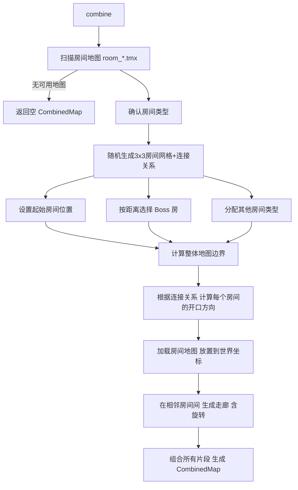
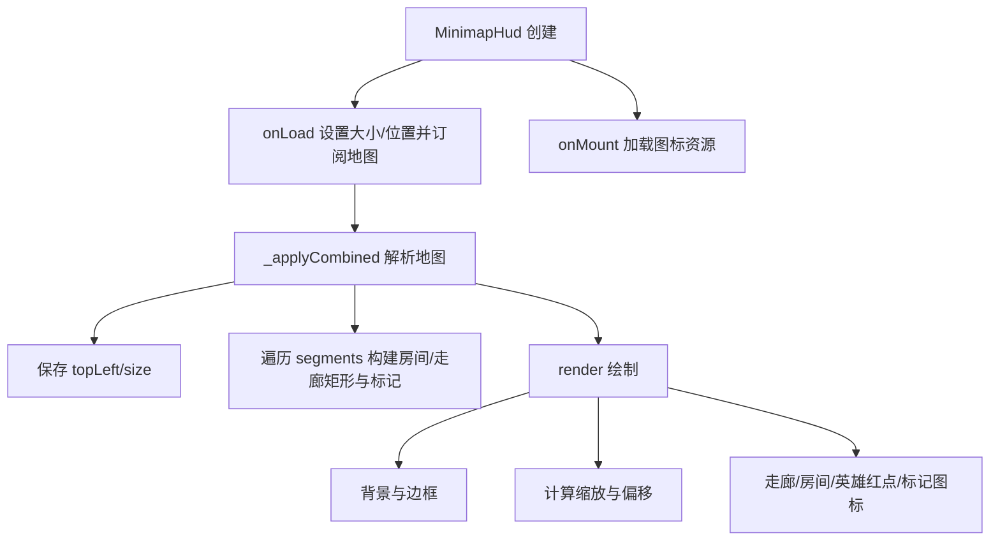

[Flutter 勇闯2D像素游戏之路（一）：一个 Hero 的诞生](https://juejin.cn/post/7579264485259411471)\
[Flutter 勇闯2D像素游戏之路（二）：绘制加载游戏地图](https://juejin.cn/post/7581025279646892070)\
[Flutter 勇闯2D像素游戏之路（三）：人物与地图元素的交互](https://juejin.cn/post/7584014975242911754)\
[Flutter 勇闯2D像素游戏之路（四）：与哥布林战斗的滑步魔法师](https://juejin.cn/post/7585463258691125257)\
[Flutter 勇闯2D像素游戏之路（五）：像元气骑士一样的设计随机地牢](https://juejin.cn/post/7588022226739200050)

# 前言

在前几篇文章中，我们已经完成了一个 **2D 像素游戏** 的基础骨架：
从 **角色的创建与动画切换，到地图绘制、人物交互，再到基础战斗逻辑**，一个 `能玩起来` 的 Demo 已经初具雏形。

但很快，一个问题就会浮现出来：

> **如果地图永远只有一张，那这个游戏还能玩多久？**

在实际游戏中，无论是 **关卡制** 还是 **肉鸽（Roguelike）玩法**，
**地图的切换、组合与随机性**，几乎都是不可或缺的。

因此，从这一章开始，我们不再只关注 `如何画一张地图`，而是正式引入 **关卡管理、地图切换、随机地牢生成** 等更贴近实际游戏开发的系统设计。


本章将以一款成熟的 **肉鸽游戏** `元气骑士` 的地牢设计为方向，并围绕以下几个关键问题展开：
-   如何将 **地图加载逻辑** 从 `MyGame` 中解耦，构建一个统一的关卡加载器？
-   如何通过 **模块化房间 + 算法布局**，生成可复用、可扩展的随机地牢？
-   当地图变得复杂之后，如何设计一个 **小地图（Minimap）系统**，帮助玩家 **可视化** 当前地牢结构？

通过这一章，你将看到一个从 `单一静态地图 -> 可切换、可随机、可视化探索的地图` 的完整过程。

>如果说前几篇是在 **搭地基**。
那么从这一篇开始，我将逐步搭建一个 **可反复游玩的游戏世界**。

# MyHero

## 一. 本章目标

## 二. 统一关卡加载器

### 1. 分析


```dart
Future<void> _loadLevel() async {
    // 1. 加载地图
    final realTileSize = mapScale * tileSize;
    final tiled = await TiledComponent.load(
      '地牢.tmx',
      Vector2.all(realTileSize),
    );
    world.add(tiled);

    // ---- 处理 thorn 中的荆棘 ----
    final thornLayer = tiled.tileMap.getLayer<ObjectGroup>('thorn');
    ...
    // ---- 处理 Key Layer 中的钥匙 ----
    final keyLayer = tiled.tileMap.getLayer<ObjectGroup>('key');
    ...
    // ---- 处理 treasure Layer 中的宝箱 ----
    final treasureLayer = tiled.tileMap.getLayer<ObjectGroup>('treasure');
    ...
    // ---- 处理 Door Layer 中的门 ----
    final doorLayer = tiled.tileMap.getLayer<ObjectGroup>('door');
    ...
    // ---- 处理 water 碰撞区 ----
    final waterLayer = tiled.tileMap.getLayer<TileLayer>('water');
    ...
    // ---- 处理 wall 碰撞 ----
    final wallLayer = tiled.tileMap.getLayer<TileLayer>('wall');
    ...
    // ---- 处理 spawn_points 中的怪物和终点 ----
    final spawnLayer = tiled.tileMap.getLayer<ObjectGroup>('spawn_points');
    ...

    // 2. 创建摇杆
    ...

    // 3. 创建英雄
    ...

    // 4. 添加进入场景
    ...

    // 5. 添加 人物信息 HUD
    ...

    // 6. 添加 攻击 HUD
    ...

    // ---- Camera ----
    camera.setBounds(Rectangle.fromLTRB(0, 0, tiled.size.x, tiled.size.y));
    camera.follow(hero);
```

当前游戏中，仅在 `my_game.dart` 中通过一个 `_loadLevel` 方法对地图进行 **硬编码加载**。\
这种方式，在我们 **早期开发** 勉强够用，但随着功能的逐渐增长，问题就出来了：

*   **地图加载写死**：难以支持多关卡切换、随机地图等玩法需求
*   **高度耦合在游戏入口中**：导致入口类职责混乱，同时承担了游戏循环、资源加载和关卡管理的 **多重职责**
*   **缺乏统一的关卡加载器**：地图、角色、敌人和相机初始化逻辑混杂在一起，后期维护和扩展成本较高

因此，我们必须将 **关卡加载** 和 **未来的切换逻辑** 从 `MyGame` 中抽离，引入独立的关卡管理层，以降低耦合度并提升扩展性。

### 2. 实现

#### （1) 新建 `LevelLoader` 关卡加载器

`LevelLoader` 负责加载和管理游戏关卡，包括：

*   加载 `Tiled` 地图文件
*   解析地图中的各种 **图层与对象（墙壁、门、钥匙、宝箱、怪物生成点等）**
*   **清除** 旧的地图内容

```dart
class LevelLoader {
  final MyGame game;
  Vector2? heroBirthPoint;

  LevelLoader(this.game);

  static const double mapScale = MyGame.mapScale;
  static const double tileSize = MyGame.tileSize;

  ...
}
```

#### （1）加载 `Tiled` 地图文件

```dart
    // ---------- 加载地图 ----------
    final realTileSize = mapScale * tileSize;
    var effectiveMap = mapName;

    final tiled = await TiledComponent.load(
      effectiveMap,
      Vector2.all(realTileSize),
```

#### （2）解析地图中的图层与对象

我们创建了 `_loadMapContent` 方法，用于解析 **Tiled** 地图中的各个 **图层和对象**，并创建对应的游戏组件。

*   **Tiled**：地图组件
*   **offset**：地图在世界坐标系中的偏移量
*   **angle**：地图旋转角度（用于走廊等）

```dart
  Future<void> _loadMapContent(
    TiledComponent tiled,
    Vector2 offset, {
    double angle = 0,
    Set<String>? openings,
  }) async {
    // ---------- 1. thorn ----------
    _loadThorn(tiled, offset, angle);

    // ---------- 2. key ----------
    _loadKey(tiled, offset, angle);

    // ---------- 3. treasure ----------
    _loadTreasure(tiled, offset, angle);

    // ---------- 4. door ----------
    _loadDoor(tiled, offset, angle, openings);

    // ---------- 5. water ----------
    _loadWater(tiled, offset, angle);

    // ---------- 6. wall ----------
    _loadWall(tiled, offset, angle);

    // ---------- 7. collisions ----------
    _loadCollisions(tiled, offset, angle);

    // ---------- 8. spawn / portal ----------
    _loadSpawnPoints(tiled, offset, angle);
  }
```

#### （3）清除旧的地图内容

我们创建了 `_clearCurrentLevel` 方法，用于 **清除旧地图** 中的各个图层和对象，为 **加载新地图** 做好准备。

*   **清除缓存的碰撞组件 `blockers`**
*   **遍历清除所有图层和对象**

```dart
void _clearCurrentLevel() {
    game.blockers.clear();
    final children = List<Component>.from(game.world.children);
    for (final c in children) {
      if (c is TiledComponent ||
          c is WaterComponent ||
          c is WallComponent ||
          c is ThornComponent ||
          c is KeyComponent ||
          c is TreasureComponent ||
          c is DoorComponent ||
          c is SpawnPointComponent ||
          c is PortalComponent) {
        c.removeFromParent();
      }
    }
  }
```

## 三. 地图切换

### 1. 绘制 `home` 地图


玩过 **类似游戏** 的大家肯定都知道，想要切换地图的前提，就是有 **多个地图**。
因此，我们也效仿一下上述图片，打造一个 `home` 地图，作为一个 **地图切换的中枢点**。
那么 `home` 地图，与我们之前绘制的并无区别，值得关注的，就只有两个点：

*   `出生点`：用于指定人物在该房间的 **出生位置**
    *   **type：birthPoint**
*   `传送门`：用于指定 **传送门** 指向的地图
    *   **type：portal**
    *   **mapId：xxx.tmx** （目标地图全称）


### 2. 传送门组件 `PortalComponent`


*   **加载传送门精灵图**：

```dart
final image = await game.images.load('portal.png');
    final sheet = SpriteSheet(image: image, srcSize: Vector2(282, 282));
    animation = sheet.createAnimation(
      row: 0,
      stepTime: 0.12,
      from: 0,
      to: 14,
      loop: true,
    );
```

*   **添加碰撞区**：

```dart
add(RectangleHitbox());
```

*   **碰撞回调触发传送**：

```dart
    AudioManager.playWhistle();
    UiNotify.showToast(game, '传送中...');
    game.levelLoader.load(mapId).then((_) {
        final bp = game.levelLoader.heroBirthPoint;
        if (bp != null) {
          game.hero.position = bp;
        }
    });
```

### 3. 效果展示


## 四. 随机地牢生成

### 1. 分析


说起 **随机地牢**，我第一时间想到的就是 `元气骑士` 。\
在对其 **地牢结构** 进行分析后不难发现，地牢的随机性并不是 **完全随机**，而是建立在 **模块化的房间** 之上。

细细分析之后，可以总结出几个关键特征：

*   **地牢中的每一个房间本质上都是可复用的 `模块`**\
    从功能上，我将这些房间大致归类为：

    *   开始房间（Start Room）
    *   小怪房间（Battle Room）
    *   宝箱房间（Treasure Room）
    *   商店房间（Shop Room）
    *   Boss 房间（Boss Room）

*   **每个房间并不直接相连，而是通过 `走廊` 进行解耦连接**\
    走廊在结构上承担了 **连接器** 的角色，使房间之间，既可以保持独立，也可以通过特定方式连接。

*   **随机地牢的核心，在于房间的 `排列方式` 的随机**\
    只要确定了房间的 **类型、数量以及它们之间的连接关系**，就可以通过算法在每次运行时 **动态生成** 不一样的地牢。

基于这个思路，随机地牢的本质可以抽象为：

> **随机地牢 = 有限房间模板 + 固定连接规则 + 随机布局算法**

### 2. 准备

有了思路之后，就在 `Tiled` 中，创建如下主要几种类型的 **房间** 和连接的 **走廊**：

*   **room\_start.tmx**
*   **room\_boss.tmx**
*   **room\_battle.tmx**
*   **room\_shop.tmx**
*   **room\_treasure.tmx**
*   **hallway.tmx**


### 3. 实现

#### (1) 扫描房间地图

随机地牢的第一步，并不是生成算法本身，而是**确定可用的房间素材集合**。\
通过扫描 `assets/tiles/` 目录中符合 `room_*.tmx` 命名规范的地图文件，系统在运行时动态获取所有可用房间模板。

```dart
...

final manifestContent = await rootBundle.loadString('AssetManifest.json');
final Map<String, dynamic> manifest = json.decode(manifestContent);

return manifest.keys
  .where(
    (String key) =>
        key.contains('assets/tiles/') &&
        key.split('/').last.startsWith('room_') &&
        key.endsWith('.tmx'),
  ).toList();

...
```

#### (2) 分类房间类型

在获取全部房间地图后，根据文件命名约定将房间划分为 **不同功能类型**：

*   **起始房间（start）**
*   **Boss 房间（boss）**
*   **宝箱房间（treasure）**
*   **商店房间（shop）**
*   **战斗房间（battle）**

同时，在这一阶段确定本次地牢的 **目标房间数量**，并初始化用于后续生成的 **网格与连接关系数据结构**。

```dart
    String? startMap = mapFiles.firstWhere(...);
    String? bossMap = mapFiles.firstWhere(...);
    String? treasureMap = mapFiles.firstWhere(...);
    String? shopMap = mapFiles.firstWhere(...);
    String? battleMap = mapFiles.firstWhere(...);

    List<String> battleMaps = mapFiles
        .where(...)
        .toList();

    if (battleMaps.isEmpty) middleMaps = [startMap];

    // MIN..MAX 个房间
    final int targetRooms = MIN_ROOMS + random.nextInt(MAX_ROOMS - MIN_ROOMS + 1);

    final Map<math.Point<int>, String> grid = {};
    final List<Connection> connections = [];
```

#### (3) 放置起始房间并生成基础布局

地牢布局被限制在一个 **3×3 的逻辑网格**内。\
**起始房间** 首先被随机放置在网格中的任意位置，随后以该点为起点，通过 `生长` 的方式逐步扩展：

*   每次从已有房间中随机选一个作为生长中心
*   随机尝试向上下左右扩展
*   只允许在 3×3 边界内生成新房间
*   同时记录房间之间的连接关系

这样就确保了：

*   地牢整体 **规模可控**
*   房间分布具有 **随机性**
*   布局始终连通，不会产生 **孤立** 房间

```dart
    // 放置起始房间 (随机位置)
    int startX = random.nextInt(GRID_COLS);
    int startY = random.nextInt(GRID_ROWS);
    math.Point<int> startPos = math.Point(startX, startY);
    grid[startPos] = startMap;

    List<math.Point<int>> frontier = [startPos];

    // 生长 (限制在 3x3 网格内)
    while (grid.length < targetRooms && frontier.isNotEmpty) {
      final index = random.nextInt(frontier.length);
      final center = frontier[index];

      final directions = [
        const math.Point(0, 1),
        const math.Point(0, -1),
        const math.Point(1, 0),
        const math.Point(-1, 0),
      ]..shuffle(random);

      for (final dir in directions) {
        final neighbor = math.Point(center.x + dir.x, center.y + dir.y);

        if (neighbor.x >= 0 &&
            neighbor.x < GRID_COLS &&
            neighbor.y >= 0 &&
            neighbor.y < GRID_ROWS) {
          if (!grid.containsKey(neighbor)) {
            grid[neighbor] = 'temp';
            connections.add(Connection(center, neighbor));
            frontier.add(neighbor);
            break;
          }
        }
      }
    }
```

#### (4) 确定 Boss 房间位置

在基础布局生成完成后，通过一次 **BFS（广度优先搜索）**，计算每个房间到起始房间的最短距离。

这样就可以让距离最远的房间，被选为 `Boss 房间`，从而形成 **由易到难** 的关卡节奏，避免 **Boss** 出现在 **开始位置附近** 的尴尬位置。

```dart
    math.Point<int> bossPos = startPos;
    double maxDist = -1;

    Map<math.Point<int>, int> distances = {startPos: 0};
    List<math.Point<int>> queue = [startPos];

    while (queue.isNotEmpty) {
      final current = queue.removeAt(0);
      final currentDist = distances[current]!;

      if (currentDist > maxDist) {
        maxDist = currentDist.toDouble();
        bossPos = current;
      }

      for (final conn in connections) {
        if (conn.from == current && !distances.containsKey(conn.to)) {
          distances[conn.to] = currentDist + 1;
          queue.add(conn.to);
        } else if (conn.to == current && !distances.containsKey(conn.from)) {
          distances[conn.from] = currentDist + 1;
          queue.add(conn.from);
        }
      }
    }
```

#### (5) 分配其余房间类型

除了 **起始房间与 Boss 房间** 外，其余房间按一定的 `随机规则` 依次分配：

*   优先保证至少 `3` 个 **战斗房间**
*   随机放置 **宝箱房和商店房**
*   剩余房间也填充为 **战斗房间**
*   将生成过程中标记为临时占位的房间统一替换为正式房间类型

```dart
    // 确保至少有 3 个战斗房间 (如果空间允许)
    if (available.isNotEmpty && battleMap != null) {
      final int need = math.min(3, available.length);
      for (int i = 0; i < need; i++) {
        ...
      }
    }

    // 放置宝箱房
    ...

    // 放置商店房
    ...

    // 填充剩余房间
    for (final p in available) {
      grid[p] = battleMaps[random.nextInt(battleMaps.length)];
    }

    // 替换所有临时标记
    grid.forEach((key, value) {
      if (value == 'temp') {
        grid[key] = battleMaps[random.nextInt(battleMaps.length)];
      }
    });
```

#### (6) 计算整体地图边界

为了让 **相机边界** 和下文中的 **小地图** 显示保持稳定，地图尺寸固定使用完整的  **3×3 网格尺寸** 进行计算。

这样可以避免：

*   不同地牢尺寸导致的小地图抖动
*   相机边界频繁变化带来的体验问题

房间在世界坐标中的实际位置，则统一通过 `getRoomPos` 进行换算。

```dart
    Vector2 getRoomPos(math.Point<int> p) {
      return Vector2(p.x * step, p.y * step);
    }
```

#### (7) 计算每个房间的开口方向

根据房间之间的连接关系，计算每个房间的 **开口方向集合**：

*   上 / 下 / 左 / 右
*   每一条连接会同时影响两个房间的开口

```dart
    final Map<math.Point<int>, Set<String>> roomOpenings = {};
    for (final p in grid.keys) {
      roomOpenings[p] = <String>{};
    }
    for (final conn in connections) {
      final p1 = conn.from;
      final p2 = conn.to;
      final dx = p2.x - p1.x;
      final dy = p2.y - p1.y;
      if (dx == 1) {
        roomOpenings[p1]!.add('right');
        roomOpenings[p2]!.add('left');
      } else if (dx == -1) {
        roomOpenings[p1]!.add('left');
        roomOpenings[p2]!.add('right');
      } else if (dy == 1) {
        roomOpenings[p1]!.add('down');
        roomOpenings[p2]!.add('up');
      } else if (dy == -1) {
        roomOpenings[p1]!.add('up');
        roomOpenings[p2]!.add('down');
      }
    }
```
>⚠️ **注意**：
>
>未使用的  **多余开口** 如果不处理就会成为上述图片那样：上下两个 **没用的门** 也被绘制出来了。
>因此，我们需要将开口集合传入 **生成门的函数 `_loadDoor` 中** 进行判断是否包含：
> - 包含，绘制为门
> - 不包含，绘制为墙
#### (8) 加载房间地图

在 **布局、房间类型和开口方向** 全部确定之后，我们就可以正式实例化房间：

*   加载对应的 `.tmx` 地图
*   根据网格坐标计算世界位置
*   将开口信息附加到房间片段中
*   统一加入到 `segments` 集合

至此，房间本身已然构建完成，但相互之间仍然是 **独立** 的。

#### (9) 生成走廊并连接房间

接下来，就是最后一步了，根据房间之间的 **连接关系** 生成 **走廊**：

*   **垂直连接**：在上下房间之间生成水平居中的走廊
*   **水平连接**：在左右房间之间生成走廊，并对走廊地图进行 90° 旋转

通过 `房间 + 走廊` 的组合方式，将 **独立房间** 拼接成一个 **完整、连通的地牢**。

### 4.流程图



## 五. 实现 MinimapHud 小地图

### 1. 分析


最后，`小地图` 可以说是 **地牢类游戏** 中不可或缺的一部分，否则大家在房间与走廊之间来回穿梭，很容易就会 **迷路** 😂。

从实现角度来看，小地图本质上并不是游戏中的 **另一张地图**，而是 **对当前地牢结构的投影**：\
将真实游戏世界中的 **房间、走廊、连接关系以及角色位置**，按统一规则 **映射** 到一块缩放后的画布上进行可视化。

> 🌟 因此，一个好的小地图通常具备以下 **特征**：
>
> *   与真实地图结构保持一致，但表现形式更加简化
> *   不承载游戏逻辑，只负责 **展示结果**
> *   能清晰表达 **房间分布、路径走向和当前位置**
>
> `小地图` 不仅是一个辅助 **UI**，更是一种 **对地图探索的即时反馈**，将 **迷路** 的 `不安` 转化为探索的 `乐趣`。

### 2. 准备


### 3. 实现


#### (1) `onLoad` 初始化

在 `onLoad` 阶段，小地图完成 **两件关键工作**：

*   根据屏幕尺寸，设置自身大小（通常为屏幕宽度的一定比例）

```dart
    // 设置小地图尺寸为屏幕宽度的 20%
    final side = game.size.x * 0.2;
```

*   固定锚点在右上角，并预留安全边距，避免遮挡主要游戏区域

```dart
    // 设置位置在右上角，留出 20 像素边距
    position = Vector2(game.size.x - 20, 20);
```

更重要的是，小地图在此阶段 **订阅关卡加载器的地图变更事件**。

```dart
    // 监听地图加载事件
    final LevelLoader loader = game.levelLoader;
    _applyCombined(loader.currentCombinedMap);
    loader.mapNotifier.addListener(() {
      _applyCombined(loader.mapNotifier.value);
    });
```

这意味着：

> 每当地牢被 **重新生成或切换**，小地图都会 **自动** 收到通知并 **刷新** 显示内容。

#### (2) `_applyCombined` 解析并缓存地图结构

初始化完成后，当新的地图数据到达时，小地图进入 **解析阶段**。

首先，从组合地图中 **读取并缓存**：

*   世界地图左上角坐标（topLeft）
*   世界地图整体尺寸（size）

这两项数据定义了**世界坐标系到小地图坐标系的转换基准**。

随后，小地图遍历随机地牢地图中的所有 **片段（segments）**，并根据类型进行处理：

*   `走廊 → 生成走廊矩形`
*   `房间 → 生成房间矩形 → 在基础上额外记录标记信息`

```dart
  /// 应用新的地图数据
  ///
  /// 当生成新地牢时调用，重新计算所有房间和走廊的显示矩形。
  void _applyCombined(CombinedMap? m) {
    ...

    // 使用 MapCombiner 计算出的完整 3x3 边界
    _worldTopLeft = m.topLeft.clone();
    _worldSize = m.size.clone();

    // 遍历所有地图片段，计算它们在小地图上的相对位置
    for (final seg in m.segments) {
      final rect = _computeSegmentRect(seg);
      if (seg.mapName.endsWith('hallway.tmx')) {
        _corridorRects.add(rect);
      } else {
        _roomRects.add(rect);

        // 识别并添加特殊房间标记
        String? type;
        if (seg.mapName.endsWith('room_start.tmx'))
          type = 'start';
        else if (seg.mapName.endsWith('room_boss.tmx'))
          type = 'boss';
        else if (seg.mapName.endsWith('room_shop.tmx'))
          type = 'shop';
        else if (seg.mapName.endsWith('room_treasure.tmx'))
          type = 'treasure';
        else if (seg.mapName.endsWith('room_battle.tmx'))
          type = 'battle';

        if (type != null) {
          _markers.add(_Marker(type, rect));
        }
      }
    }
  }
```

#### (3) `render` 小地图绘制阶段

每一帧渲染时，小地图按照固定顺序绘制所有内容。

*   **背景与边框**

    首先绘制半透明背景和外边框，用于明确 `MinimapHud` 区域边界。

    ```dart
        // 绘制背景和边框
        final bgRect = Rect.fromLTWH(0, 0, size.x, size.y);
        canvas.drawRect(bgRect, _bgPaint);
        canvas.drawRect(bgRect, _borderPaint);
    ```

*   **计算缩放与偏移**

    随后，根据世界地图尺寸与小地图可用区域，计算合适的 **缩放比例**。\
    这一计算保证了无论地牢布局如何 **变化**，**3×3 网格** 在小地图中的位置和尺度始终 **稳定**。

    ```dart
      double _fitFactor() {
        final availW = size.x - 2 * _padding;
        final availH = size.y - 2 * _padding;

        final fx = availW / _worldSize.x;
        final fy = availH / _worldSize.y;

        // 取宽高中较小的缩放比，确保内容完全可见
        final base = math.min(fx, fy);
        final effectiveZoom = math.min(_zoom, 1.0);

        return base * effectiveZoom * _contentScale;
      }
    ```

*   **绘制地图内容与状态信息**

    在 **缩放与偏移** 确定后，**按层级依次绘制**：

    1.  走廊结构（房间之间的连接）
    2.  房间轮廓（地图主体结构）
    3.  英雄当前位置（红色圆点，实时更新）
    4.  特殊房间标记图标（起点、Boss、商店等）

    所有元素均基于同一套 `世界 → 小地图` 的坐标映射规则，确保 **结构与角色位置** 的准确对应。

    ```dart
        // 绘制走廊
        for (final r in _corridorRects) {
          drawRectScaled(r, _corridorPaint);
        }

        // 绘制房间
        for (final r in _roomRects) {
          drawRectScaled(r, _roomPaint);
        }

        // 绘制英雄位置
        final heroX = heroMinimapX + centerOffsetX;
        final heroY = heroMinimapY + centerOffsetY;
        canvas.drawCircle(Offset(heroX, heroY), 3, _heroPaint);

        // 绘制特殊房间图标
        for (final m in _markers) {
          final img = _icons[m.type];
          if (img == null) continue;

          // 计算图标位置（居中显示在房间矩形内）
          final cx =
              m.rect.left * factor + centerOffsetX + m.rect.width * factor / 2;
          final cy =
              m.rect.top * factor + centerOffsetY + m.rect.height * factor / 2;
          final half = _iconSize / 2;

          final dst = Rect.fromLTWH(cx - half, cy - half, _iconSize, _iconSize);
          final src = Rect.fromLTWH(
            0,
            0,
            img.width.toDouble(),
            img.height.toDouble(),
          );
          canvas.drawImageRect(img, src, dst, Paint());
        }
    ```

#### (4) `onMount` 加载特殊标记资源

在组件正式挂载完成后，小地图加载所需的 **特殊标记资源**。

> 将资源加载放在 `onMount` 阶段，可以避免阻塞地图解析流程，同时确保资源在首次渲染前已准备就绪。

```dart
@override
  Future<void> onMount() async {
    super.onMount();
    // 加载图标资源
    _icons['start'] = await game.images.load('map/start.png');
    _icons['boss'] = await game.images.load('map/boss.png');
    _icons['treasure'] = await game.images.load('map/treasure.png');
    _icons['shop'] = await game.images.load('map/shop.png');
    _icons['battle'] = await game.images.load('map/battle.png');
  }
```

### 4. 流程图



## 六. 总结与展望

### 总结

本章主要介绍了 **Flutter\&Flame** 开发 **2D像素游戏** 关于 `地图切换、随机地牢和小地图` 的基础实践。\
通过上述步骤，我们完成了`人物hud界面、近战、远程、冲刺和召唤` 这几类常见攻击元素的实现。

截至目前为止，游戏主要包括了以下内容：

*   **角色与动画**：使用精灵图 (`SpriteSheet`) 创建角色，支持 idle/run 等动画状态切换。
*   **玩家交互**：通过摇杆控制角色移动，并根据方向翻转动画。
*   **地图加载**：通过 `Tiled` 绘制并在 **Flame** 中加载的 **2d像素地图**。
*   **地图交互**：通过组件化模式，新建了多个可供交互的组件如（**门、钥匙、宝箱、地刺**），为游戏增加了互动性。
*   **地图切换**：通过 `统一关卡加载器` 读取当前地图中存储的 **目标地图**，实现动态切换。
*   **地图生成**：通过 `Tiled` 绘制出一批通用房间，规定 **地图大小与房间数量**，通过算法生成 **随机地图**。
*   **小地图**：通过 `小地图`， 可以清晰的 **可视化** 的看清随机地图结构。
*   **统一碰撞区检测**：将角色与 **需要产生碰撞** 的物体统一管理，并实现碰撞时的 **平滑侧移**。
*   **统一人物配置创建**： 通过将角色数据配置为文件，达到以动态数据驱动模型的目的。
*   **HUD界面**： 包括 `人物血量条` 和 `技能按钮`。
*   **完善的攻击逻辑**：通过统一基类实现`近战、远程、冲刺` 的攻击方式 和 独特 `召唤` 技能。

### 展望

*   思考 🤔 一个有趣的游戏机制ing ...

*   模仿元气骑士的武器机制

*   完善随机地牢内游戏内容

*   进阶这个demo版

*   支持局域网多玩家联机功能。

> [🎮 MyHero 在线体验](http://myhero.shanchen.space)\
> [🚪 github 源码](https://github.com/TheSyart/myhero)\
> [💻 个人门户网站](https://www.shanchen.space)

***

</p>
<p align="center"><i>之前尝试的Demo预览</i></p>

---

[原文发布于 CSDN](https://blog.csdn.net/m0_70561094/article/details/156300781)
